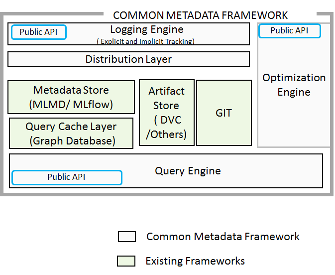
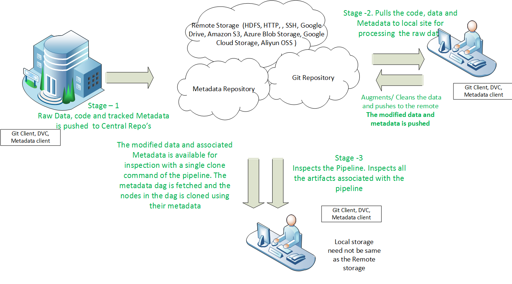

# cmf
## Common Metadata Framework
[Getting Started](https://hewlettpackard.github.io/cmf/)  
[Detailed documentation of the API's](https://hewlettpackard.github.io/cmf/api/public/cmf)   

Interactions in data pipelines can be complex. The Different stages in the pipeline, (which may not be next to each other) may have to interact to produce or transform artifacts. As the artifacts navigates and undergo transformations through this pipeline, it can take a complicated path, which might also involve bidirectional movement across these stages.  Also there could be dependencies between the multiple stages, where the metrics produced by a stage could influence the metrics at a subsequent stage.  It is important to track the metadata across a pipeline to provide features like, lineage tracking, provenance and reproducibility.  

The tracking of metadata through these complex pipelines have multiple challenges, some of them being,  

- Each stage in the pipeline could be executed in a different datacenter or an edge site having intermittent connection to the core datacenter.   

- Each stage in the pipeline could be possibly managed by different teams.  

- The artifacts (input or output) needs to be uniquely identified across different sites and across multiple pipelines. 

Common metadata framework (CMF) addresses the problems associated with tracking of pipeline metadata from distributed sites and tracks code, data and metadata together for end-to-end traceability.   

The framework automatically tracks the code version as one of the metadata for an execution. Additionally the data artifacts are also versioned automatically using a data versioning framework (like DVC) and the metadata regarding the data version is stored along with the code. The framework stores the Git commit id of the metadata file associated with the artifact and content hash of the artifact as metadata. The framework provides API’s to track the hyper parameters and other metadata of pipelines.  Therefore from the metadata stored, users can zero in on the hyper parameters, code version and the artifact version used for the experiment. 

Identifying the artifacts by content hash allows the framework, to uniquely identify an artifact anywhere in the distributed sites. This enables the metadata from the distributed sites to be precisely merged to a central repository, thereby providing a single global metadata from the distributed sites.   

On this backbone, we build the Git like experience for metadata, enabling users to push their local metadata to the remote repository, where it is merged to create the global metadata and pull metadata from the global metadata to the local, to create a local view, which would contain only the metadata of interest. 

The framework can be used to track various types of pipelines such as data pipelines or AI pipelines. 

 

 

 

### Common metadata framework (CMF), has the following components, 

CMF - Metadata library - Exposes API’s to track the pipeline metadata. It also provides API’s to query the stored metadata. 

CMF local client – The client interacts with the server to pull or push metadata from or to the remote store. 

CMF central server - Interacts with all the remote clients and is responsible to merge the metadata transferred by the remote client and manage the consolidated metadata.  

 CMF central repositories - Host the code, data and metadata. 

  

### Metadata library

The API’s and the abstractions provided by the library enables tracking of pipeline metadata. It tracks the stages in the pipeline, the input and output artifacts at each stage and metrics. The framework allows metrics to be tracked both at coarse and fine grained intervals. It could be a stage metrics, which could be captured at the end of a stage or fine grained metrics which is tracked per step (epoch) or at regular intervals during the execution of the stage. 

The metadata logged through the API’s are written to a backend relational database. The library also provides API’s to query the metadata stored in the relational database for the users to inspect pipelines.   

In addition to explicit tracking through the API’s library also provides, implicit tracking. The implicit tracking automatically tracks the software version used in the pipelines. The function arguments and function return values can be automatically tracked by adding metadata tracker class decorators on the functions. 

Before writing the metadata to relational database, the metadata operations are journaled in the metadata journal log. This enables the framework to transfer the local metadata to the central server. 

All artifacts are versioned with a data versioning framework (for e.g., DVC). The content hash of the artifacts are generated and stored along with the user provided metadata. A special artifact metadata file called a “.dvc” file is created for every artifact (file / folder) which is added to data version management system. The .dvc file contains the content hash of the artifact.  

For every new execution, the metadata tracker creates a new branch to track the code. The special metadata file created for artifacts, the “.dvc” file is also committed to GIT and its commit id is tracked as a metadata information.  The artifacts are versioned through the versioning of its metadata file. Whenever there is a change in the artifact, the metadata file is modified to reflect its current content hash, and the file is tracked as a new version of the metadata file.  

The metadata tracker automatically tracks the start commit when the library was initialized and creates separate commit for each change in the artifact along the experiment. This helps to track the transformations on the artifacts along the different stages in the pipeline. 

To understand more details, see documentation [here](docs/README.md)

### Metadata client 

The metadata client interacts with the metadata server. It communicates with the server, for synchronization of metadata.  

After the experiment is completed, the user invokes the “Cmf push” command to push the collected metadata to the remote. This transfers the existing metadata journal to the server.  

The metadata from the central repository can be pulled to the local repository, either using the artifacts or using the project as the identifier or both. 

When artifact is used as the identifier, all metadata associated with the artifacts currently present in the branch of the cloned Git repository is pulled from the central repository to the local repository. The pulled metadata consist of not only the immediate metadata associated with the artifacts, it contains the metadata of all the artifacts in its chain of lineage. 

When project is used as the identifier, all the metadata associated with the current branch of the pipeline code that is checked out is pulled to the local repository. 

### Central server 

The central server, exposes REST API’s that can be called from the remote clients. This can help in situations where the connectivity between the core datacenter and the remote client is robust. The remote client calls the API’s exposed by the central server to log the metadata directly to the central metadata repository.  

Where the connectivity with the central server is intermittent, the remote clients log the metadata to the local repository. The journaled metadata is pushed by the remote client to the central server. The central server, will replay the journal and merge the incoming metadata with the metadata already existing in the central repository. The ability to accurately identify the artifacts anywhere using their content hash, makes this merge robust. 

### Central Repositories 

The common metadata framework consist of three central repositories for the code, data and metadata. 

#### Central Metadata repository 

Central metadata repository holds the metadata pushed from the distributed sites. It holds metadata about all the different pipelines that was tracked using the common metadata tracker.  The consolidated view of the metadata stored in the central repository, helps the users to learn across various stages in the pipeline executed at different locations. Using the query layer that is pointed to the central repository, the users gets the global view of the metadata which provides them with a deeper understanding of the pipelines and its metadata.  The metadata helps to understand nonobvious results like performance of a dataset with respect to other datasets, Performance of a particular pipeline with respect to other pipelines etc. 

#### Central Artifact storage repository 

Central Artifact storage repository stores all the artifacts related to experiment. The data versioning framework (DVC) stores the artifacts in a content addressable layout. The artifacts are stored inside the folder with name as the first two characters of the content hash and the name of the artifact as the remaining part of the content hash. This helps in efficient retrieval of the artifacts.   

#### Git Repository 

Git repository is used to track the code. Along with the code, the metadata file of the artifacts which contain the content hash of the artifacts are also stored in GIT. The Data versioning framework (dvc) would use these files to retrieve the artifacts from the artifact storage repository. 

### Advantages  

1. Tracking of metadata for distributed pipeline, thereby enabling efficient pipeline 

2. Enables tracking of code, data and metadata in a single framework. 

3. Provides a git like ease of management for metadata. 

4. Provides collaboration across teams

### Talks and Papers
1. <a href="https://drive.google.com/file/d/1Oqs0AN0RsAjt_y9ZjzYOmBxI8H0yqSpB/view" target="_blank">Monterey data conference 2022</a>

### Community

<a href="https://commonmetadata.slack.com/" target="_blank"> Slack: Common Metadata Framework</a>
