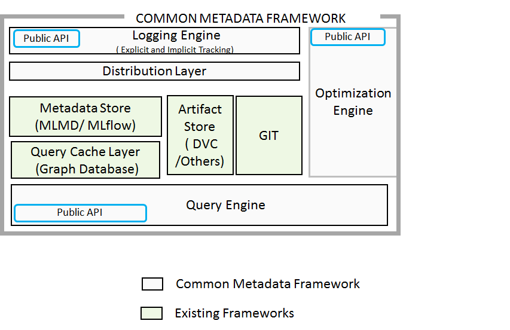
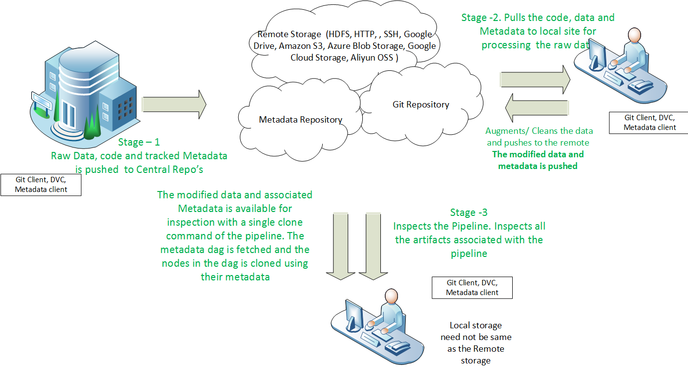

# Common Metadata Framework (CMF)

[](https://github.com/HewlettPackard/cmf/actions)
[](https://pypi.org/project/cmflib/)
[](https://hewlettpackard.github.io/cmf/)
[](./LICENSE)

**Common Metadata Framework (CMF)** is a metadata tracking and versioning system for ML pipelines. It tracks code, data, and pipeline metrics—offering Git-like metadata management across distributed environments.

---

## 🚀 Features

- ✅ Track artifacts (datasets, models, metrics) using content-based hashes  
- ✅ Automatically logs code versions (Git) and data versions (DVC)  
- ✅ Push/pull metadata via CLI across distributed sites  
- ✅ REST API for direct server interaction  
- ✅ Implicit & explicit tracking of pipeline execution  
- ✅ Fine-grained or coarse-grained metric logging  

---

## 🏛 Quick Start

Get started with CMF in minutes using our example ML pipeline:

**[📖 Try the Getting Started Example](./examples/example-get-started/)**

This example demonstrates:
- Initializing a CMF project
- Tracking an ML pipeline with multiple stages (parse → featurize → train → test)
- Versioning datasets and models
- Pushing artifacts and metadata
- Querying tracked metadata


## 📦 Installation

### Requirements

- Linux/Ubuntu/Debian
- Python: Version 3.9 to 3.11 (3.10 recommended)
- Git (latest)

### Virtual Environment

<details><summary>Conda</summary>

```bash
conda create -n cmf python=3.10
conda activate cmf
```
</details>

<details><summary>Virtualenv</summary>

```bash
virtualenv --python=3.10 .cmf
source .cmf/bin/activate
```
</details>

### Install CMF

<details><summary>Latest from GitHub</summary>

```bash
pip install git+https://github.com/HewlettPackard/cmf
```
</details>

<details><summary>Stable from PyPI</summary>

```bash
pip install cmflib
```
</details>

### Server Setup

📖 Follow the [CMF Server Installation Guide](https://hewlettpackard.github.io/cmf/setup/index.html#install-cmf-server-with-gui)

---

## 📘 Documentation

- [Getting Started](https://hewlettpackard.github.io/cmf/)
- [API Reference](https://hewlettpackard.github.io/cmf/api/public/cmf)
- [Command Reference](https://hewlettpackard.github.io/cmf/cmf_client/index)
- [Related Docs](https://deepwiki.com/HewlettPackard/cmf)

---

## 🧠 How It Works

CMF tracks pipeline stages, inputs/outputs, metrics, and code. It supports decentralized execution across datacenters, edge, and cloud.

- Artifacts are versioned using DVC (`.dvc` files).
- Code is tracked with Git.
- Metadata is logged to relational DB (e.g., SQLite, PostgreSQL)
- Sync metadata with `cmf metadata push` and `cmf metadata pull`.

---

## 🏛 Architecture

CMF is composed of:

- **cmflib** - Metadata library provides API to log/query metadata
- **CMF Client** – CLI to sync metadata with server, push/pull artifacts to the user-specified repo, push/pull code from Git
- **CMF Server** – REST API for metadata merge
- **Central Repositories** – Git (code), DVC (artifacts), CMF (metadata)

<p align="center">
  
</p>

<p align="center">
  
</p>

---

## 🔧 Sample Usage

```python
from cmflib.cmf import Cmf
from ml_metadata.proto import metadata_store_pb2 as mlpb

metawriter = Cmf(filename="mlmd", pipeline_name="test_pipeline")

context: mlpb.Context = metawriter.create_context(
    pipeline_stage="prepare",
    custom_properties={"user-metadata1": "metadata_value"}
)

execution: mlpb.Execution = metawriter.create_execution(
    execution_type="Prepare",
    custom_properties={"split": split, "seed": seed}
)

artifact: mlpb.Artifact = metawriter.log_dataset(
    "artifacts/data.xml.gz", "input",
    custom_properties={"user-metadata1": "metadata_value"}
)
```

```bash
cmf                          # CLI to manage metadata and artifacts
cmf init                     # Initialize artifact repository
cmf init show                # Show current CMF config
cmf metadata push            # Push metadata to server
cmf metadata pull            # Pull metadata from server
```
	
➡️ For the complete list of commands, please refer to the <a href="https://hewlettpackard.github.io/cmf/cmf_client/index">Command Reference</a>


---

## ✅ Benefits

- Full ML pipeline observability
- Unified metadata, artifact, and code tracking
- Scalable metadata syncing
- Team collaboration on metadata

---

## 🎤 Talks & Publications

- 🎙 [Monterey Data Conference 2022](https://drive.google.com/file/d/1Oqs0AN0RsAjt_y9ZjzYOmBxI8H0yqSpB/view)

---

## 🌐 Related Projects

- [📚 Common Metadata Ontology](https://hewlettpackard.github.io/cmf/common-metadata-ontology/readme/)
- [🧠 AI Metadata Knowledge Graph (AIMKG)](https://github.com/HewlettPackard/ai-metadata-knowledge-graph)
---

## 🤝 Community

- 💬 [Join CMF on Slack](https://commonmetadata.slack.com/)
- 📧 Contact: **annmary.roy@hpe.com**

---

## 📄 License

Licensed under the [Apache 2.0 License](./LICENSE)

---

> © Hewlett Packard Enterprise. Built for reproducibility in ML.
