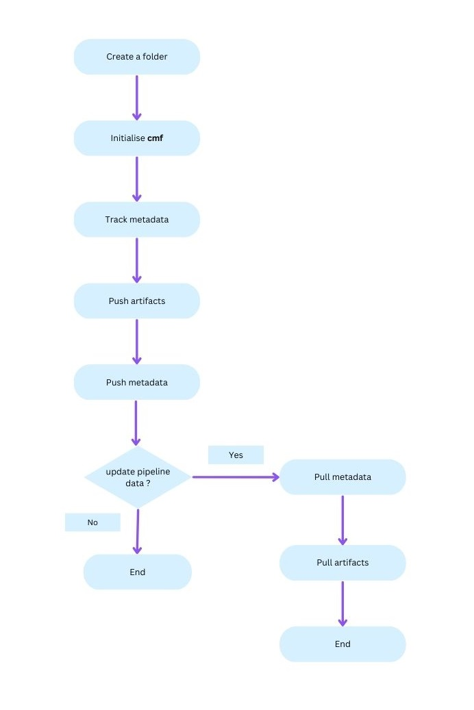

# Getting started with cmf
Common Metadata Framework (CMF) has the following components:

- **Metadata Library** exposes APIs to track pipeline metadata. It also provides APIs to query the stored metadata.
- **CMF Client** interacts with the CMF Server to pull or push metadata.
- **CMF Server with GUI** interacts with remote CMF Clients and merges the metadata transferred by each
  client. This server also provides a GUI that can render the stored metadata.
- **Central Artifact Repositories** host the code and data.

## Setup a CMF Client
`CMF Client` is a tool that facilitates metadata collaboration between different teams and team members. These clients
interact with the CMF Server to push/pull metadata.

**Pre-Requisites**

- Python 3.9+
- Git latest version

**Install cmf library i.e. cmflib**
```
pip install https://github.com/HewlettPackard/cmf
```
**OR**
```
pip install cmflib
```
[Documentation](https://hewlettpackard.github.io/cmf/) for more details.

## Install CMF Server
CMF Server is the primary interface for the user to explore and track their ML training runs by browsing the stored
metadata. Users can retrieve the saved metadata file and can view the content of the saved metadata file using
the UI provided by the CMF Server.

Details on how to set up a CMF Server can be found [here](../setup/index.md#install-cmf-server-with-gui).

## Simple Example of using the CMF Client
In this example, CMF is used to track the metadata for a pipeline named `Test-env` which interacts with a local artifact repository and a CMF Server.

**Setup the example directory**
```
mkdir example-folder && cd example-folder
```

### Initialize cmf

CMF must be initialized to use CMF Client commands. The following command configures a local artifact repository and specifies the connection to a CMF server.

**Basic Usage (Required Parameters Only):**
```
cmf init local --path /path/to/local-storage --git-remote-url https://github.com/user/experiment-repo.git
```

**With Optional Parameters:**
```
cmf init local --path /path/to/local-storage --git-remote-url https://github.com/user/experiment-repo.git --cmf-server-url http://x.x.x.x:80 --neo4j-user neo4j --neo4j-password password --neo4j-uri bolt://localhost:7687
```
Check [here](./cmf_client_commands.md) for more details.

**Check status of CMF initialization (Optional)**
```
cmf init show
```
Check [here](./cmf_client_commands.md) for more details.

**Track metadata using cmflib**

Use [Sample projects](https://github.com/HewlettPackard/cmf/tree/master/examples) as a reference to create a new project to track metadata for ML pipelines.

More info is available [here](https://hewlettpackard.github.io/cmf/examples/getting_started/).

**Push artifacts**

Push artifacts in the artifact repository initialized in the [Initialize cmf](#initialize-cmf) step.
```
cmf artifact push
```
Check [here](./cmf_client_commands.md) for more details.

**Push metadata to CMF Server**
```
cmf metadata push -p 'Test-env'
```
Check [here](./cmf_client_commands.md) for more details.

### CMF Client with collaborative development
In the case of collaborative development, in addition to the above commands, users can follow the commands below to pull metadata and artifacts from a common CMF Server and a central artifact repository.

**Pull metadata from the server**

Execute `cmf metadata` command in the `example_folder`.
```
cmf metadata pull -p 'Test-env'
```
Check [here](./cmf_client_commands.md) for more details.

**Pull artifacts from the central artifact repository**

Execute `cmf artifact` command in the `example_folder`.
```
cmf artifact pull -p "Test-env"
```
Check [here](./cmf_client_commands.md) for more details.

## Flow Chart for cmf

