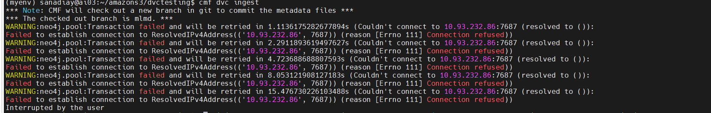

# Step-by-Step Guide to Use the `cmf dvc ingest` Command

The `cmf dvc ingest` command is used to ingest metadata from the `dvc.lock` file into the CMF server. If an existing MLMD (Metadata) file is provided, the command will merge and update execution metadata based on matching commands or create new executions if none exist.


## 📌 Steps to Get Started

Follow the steps below to set up CMF client and use the `dvc ingest` command.


## 1. Navigate to Your Project Directory

Open your terminal and go to the directory (for e.g., `example-get-started`) where you want to use CMF commands.

```bash
cd /path/to/your/project
```


## 2. Initialize CMF with Neo4j Credentials

Use the following command to initialize CMF. You can choose from various storage options like `local`, `ssh`, `amazons3`, `osdfremote`, or `minios3`.

```bash
   cmf init local \
  --path /home/XXXX/local-storage \
  --git-remote-url https://github.com/user/experiment-repo.git \
  --cmf-server-url http://x.x.x.x:8080 \
  --neo4j-user neo4j \
  --neo4j-password password \
  --neo4j-uri bolt://x.x.x.x:7687
```

> 🔁 Replace the following:
> - `x.x.x.x` with your IP address  
> - `XXXX` with your system username  
> - Provide your correct Neo4j username and password


## 3. Start the Neo4j Server

Start the Neo4j server using Docker. Follow the guide provided below:

📄 [Start Neo4j with Docker ](./neo4j_docker.md)


## 4. Create a `dvc.yaml` File

Inside your project directory (for e.g., `example-get-started`), create a `dvc.yaml` file.

Here’s a sample `dvc.yaml`:

<details>
<summary>Click to expand</summary>

```yaml
stages:
  prepare:
    cmd: python src/parse.py artifacts/data.xml.gz artifacts/parsed/
    deps:
      - artifacts/data.xml.gz
    outs:
      - artifacts/parsed/train.tsv
      - artifacts/parsed/test.tsv

  featurize:
    cmd: python src/featurize.py artifacts/parsed/ artifacts/features/
    deps:
      - artifacts/parsed/train.tsv
      - artifacts/parsed/test.tsv
    outs:
      - artifacts/features/train.pkl
      - artifacts/features/test.pkl

  train:
    cmd: python src/train.py artifacts/features/ artifacts/model/
    deps:
      - artifacts/features/train.pkl
      - artifacts/features/test.pkl
    outs:
      - artifacts/model/model.pkl

  test:
    cmd: python src/test.py artifacts/model/ artifacts/features/ artifacts/test_results/
    deps:
      - artifacts/model/model.pkl
    outs:
      - artifacts/test_results/prc.json
      - artifacts/test_results/roc.json
      - artifacts/test_results/scores.json
```

</details>


## 5. Remove CMF code from Your `src` Directory

Ensure that your source files inside the `example-get-started/src` directory do **not contain any CMF-related code**. Keep them clean and focused on their tasks.


## 6. Run the DVC Pipeline

Execute your pipeline using the following command. This will also generate a `dvc.lock` file.

```bash
dvc repro
```


## 7. Ingest Metadata with CMF

Run the following command to create metadata file based on your `dvc.lock` file:

```bash
cmf dvc ingest
```

> ⚠️ **Troubleshooting:**  
> If you see an error like the one below, your Neo4j server might not be running properly.




## 8. Push/Pull Metadata and Artifacts

Use [CMF client commands](./cmf_client.md) to push or pull your metadata and artifacts as required:

- `cmf metadata push`
- `cmf metadata pull`
- `cmf artifact push`
- `cmf artifact pull`
