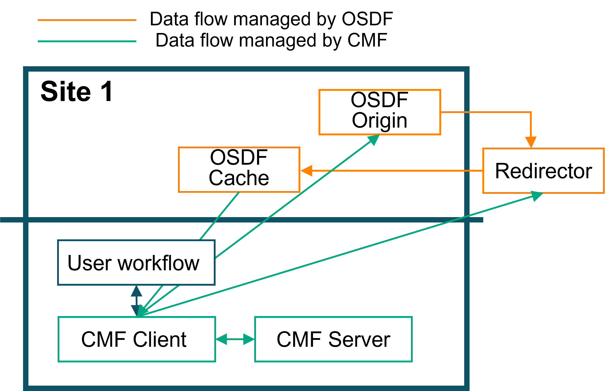

# OSDF Remote Artifact Setup
## Steps to set up an OSDF Remote Repo

Backed by the [Pelican Platform](https://pelicanplatform.org/), the Open Science Data Federation (OSDF) is an OSG service hosting data origins and caches across the globe.

OSDF facilitates the distributed nature of a national compute pool. CMF supports OSDF Origins and caches as remotes to push/pull data from/to. 

OSDF provides a distributed data federation that allows researchers to store and access data across multiple institutions and geographic locations. It uses tokens for authentication and supports caching for improved performance.

Proceed with the following steps to set up an OSDF Remote Repository:

1. Initialize the `project directory` with an OSDF remote.
2. Check whether cmf is initialized in your project directory with the following command.
   ```
   cmf init show
   ```
   If cmf is not initialized, the following message will appear on the screen.
   ```
   'cmf' is not configured.
   Execute the 'cmf init' command.
   ```

3. Execute the following command to initialize the OSDF remote storage as a CMF artifact repository.
   ```
   cmf init osdfremote --path https://fdp-origin.labs.hpe.com:8443/fdp-hpe/cmf_test \
       --cache https://osdf-director.osg-htc.org/ \
       --key-id XXXX \
       --key-path ~/private_hpe.pem \
       --key-issuer https://t.nationalresearchplatform.org/fdp-hpe \
       --git-remote-url https://github.com/user/experiment-repo.git
   ```
   
   Parameters:
   - `--path`: The OSDF origin server URL where data will be stored
   - `--cache`: The OSDF cache/director URL for retrieving data
   - `--key-id`: The key identifier for authentication
   - `--key-path`: Path to the private key file for token generation
   - `--key-issuer`: The issuer URL for token generation
   - `--git-remote-url`: Git repository URL for version control

4. Execute `cmf init show` to check the CMF configuration.

5. After initialization, you can push artifacts to OSDF (It is presumed you have done cmf artifact add to register the artifacts):
   ```
   cmf artifact push -p Test-env
   ```

6. To pull artifacts from OSDF (using the cache for performance):
   ```
   cmf artifact pull -p Test-env
   ```

   The pull command will automatically use the configured cache server for faster downloads.

## Notes

- Ensure you have the proper authentication credentials from your OSDF provider
   - private key, 
   - key ID, 
   - issuerURL, 
   - origin FQDN and Federation Path 
- The cache server (`--cache`) is used for reading data to improve performance (It identifies files directly from their path and contacts the topologically nearest cache to pull from)
- The origin server (`--path`) is used for writing data (push). Caches cannot be written to. 
- OSDF uses token-based authentication that is automatically generated from your private key. This is handled internally by CMF under the covers. 
- CMF also verifies that the retrieved file has the same Hash value as is recorded in MLMD


## End to End Examples 



### Single Site

#### Pushing Artifacts 
- Running CMF's examples/example-getting-started workflow and pushing artifacts to a specific remote

```
(cmf) tripataa@ai07:~/cmf-examples/example-get-started$ cmf init osdfremote --path https://fdp-origin.labs.hpe.com:8443/fdp-hpe/cmf_test           --cache https://osdf-director.osg-htc.org/   --key-id XXXX    --key-path ~/private_hpe.pem    --key-issuer https://t.nationalresearchplatform.org/fdp-hpe --git-remote-url https://github.com/user/experiment-repo.git
git_dir /home/tripataa/cmf-examples/example-get-started/.git
Starting cmf init.
Setting 'osdf' as a default remote.
SUCCESS: cmf init complete.
(cmf) tripataa@ai07:~/cmf-examples/example-get-started$


(cmf) tripataa@ai07:~/cmf-examples/example-get-started$ chmod +x test_script.sh
(cmf) tripataa@ai07:~/cmf-examples/example-get-started$ ./test_script.sh

[1/5] [RUNNING PARSE STEP         ]
*** Note: CMF will check out a new branch in git to commit the metadata files ***
*** The checked out branch is mlmd. ***
100% Adding...|########################################|1/1 [00:00, 39.58file/s]
100% Adding...|########################################|1/1 [00:00, 25.10file/s]
100% Adding...|########################################|1/1 [00:00, 17.65file/s]
100% Adding...|########################################|1/1 [00:00, 37.17file/s]

[2/5] [RUNNING FEATURIZE STEP     ]
*** Note: CMF will check out a new branch in git to commit the metadata files ***
*** The checked out branch is mlmd. ***
100% Adding...|########################################|1/1 [00:00, 62.53file/s]
100% Adding...|########################################|1/1 [00:00, 31.05file/s]
100% Adding...|########################################|1/1 [00:00, 47.68file/s]
The input data frame artifacts/parsed/train.tsv size is (20017, 3)
The output matrix artifacts/features/train.pkl size is (20017, 3002) and data type is float64
The input data frame artifacts/parsed/test.tsv size is (4983, 3)
The output matrix artifacts/features/test.pkl size is (4983, 3002) and data type is float64
100% Adding...|########################################|1/1 [00:00, 26.49file/s]
100% Adding...|########################################|1/1 [00:00, 47.62file/s]

(cmf) tripataa@ai07:~/cmf-examples/example-get-started$ cmf artifact push -p Test-env
Collecting                                            |0.00 [00:00,    ?entry/s]
Pushing...
Everything is up to date.
```

#### Pulling Artifacts (via Cache) 
- Pulling artifacts via a cache. 
- The --cache path is specified 
- The artifacts for the pipeline: `Test-env` is pulled into a test/ folder (as an example)
- CMF looks at it's MLMD index and fetches the necessary files form the cache when configured. 

```
(cmf) tripataa@ai07:~/cmf-examples/test$ ls
mlmd
(cmf) tripataa@ai07:~/cmf-examples/test$ cmf init osdfremote --path https://fdp-origin.labs.hpe.com:8443/fdp-hpe/cmf_test \
          --cache https://osdf-director.osg-htc.org/ \
        --key-id XXX \
        --key-path ~/private_hpe.pem \
        --key-issuer https://t.nationalresearchplatform.org/fdp-hpe \
--git-remote-url https://github.com/user/experiment-repo.git
git_dir /home/tripataa/cmf-examples/test/.git
Starting git init.
*** Note: CMF will check out a new branch in git to commit the metadata files
***
*** The checked out branch is master. ***
git init complete.
Starting cmf init.
Setting 'osdf' as a default remote.
SUCCESS: cmf init complete.

(cmf) tripataa@ai07:~/cmf-examples/test$ cmf artifact pull -p Test-env
Fetching
artifact=cmf_artifacts/python_env_4927239f4c14b700b637ff03ab787e65.yaml,
surl=https://osdf-director.osg-htc.org/fdp-hpe/cmf_test/files/md5/49/27239f4c14b
700b637ff03ab787e65 to
./cmf_artifacts/python_env_4927239f4c14b700b637ff03ab787e65.yaml
object cmf_artifacts/python_env_4927239f4c14b700b637ff03ab787e65.yaml downloaded
at ./cmf_artifacts/python_env_4927239f4c14b700b637ff03ab787e65.yaml in 0.00
seconds and matches MLMD records.
Fetching artifact=artifacts/data.xml.gz,
surl=https://osdf-director.osg-htc.org/fdp-hpe/cmf_test/files/md5/23/6d9502e0283
d91f689d7038b8508a2 to ./artifacts/data.xml.gz
object artifacts/data.xml.gz downloaded at ./artifacts/data.xml.gz in 0.02
seconds and matches MLMD records.
Fetching artifact=artifacts/parsed/train.tsv,
surl=https://osdf-director.osg-htc.org/fdp-hpe/cmf_test/files/md5/32/b715ef0d71f
f4c9e61f55b09c15e75 to ./artifacts/parsed/train.tsv
object artifacts/parsed/train.tsv downloaded at ./artifacts/parsed/train.tsv in
0.03 seconds and matches MLMD records.
Fetching artifact=artifacts/parsed/test.tsv,
surl=https://osdf-director.osg-htc.org/fdp-hpe/cmf_test/files/md5/6f/597d341ceb7
d8fbbe88859a892ef81 to ./artifacts/parsed/test.tsv
object artifacts/parsed/test.tsv downloaded at ./artifacts/parsed/test.tsv in
0.01 seconds and matches MLMD records.
Fetching artifact=artifacts/features/train.pkl,
surl=https://osdf-director.osg-htc.org/fdp-hpe/cmf_test/files/md5/f2/17d9bdb2523
c54e71dcb95fcf16ff2 to ./artifacts/features/train.pkl
object artifacts/features/train.pkl downloaded at ./artifacts/features/train.pkl
in 0.02 seconds and matches MLMD records.
Fetching artifact=artifacts/features/test.pkl,
surl=https://osdf-director.osg-htc.org/fdp-hpe/cmf_test/files/md5/30/4cfed883c9c
0cecaeb7f0079e4b98c to ./artifacts/features/test.pkl
object artifacts/features/test.pkl downloaded at ./artifacts/features/test.pkl
in 0.00 seconds and matches MLMD records.
Fetching
artifact=cmf_artifacts/f3d287ba-5cf8-11f0-bf02-d4c9efce8c58/metrics/training_met
rics,
surl=https://osdf-director.osg-htc.org/fdp-hpe/cmf_test/files/md5/64/d2da21bb624
9afc9ea5a3a5cd67cc7 to
./cmf_artifacts/f3d287ba-5cf8-11f0-bf02-d4c9efce8c58/metrics/training_metrics
object
cmf_artifacts/f3d287ba-5cf8-11f0-bf02-d4c9efce8c58/metrics/training_metrics
downloaded at
./cmf_artifacts/f3d287ba-5cf8-11f0-bf02-d4c9efce8c58/metrics/training_metrics in
0.00 seconds and matches MLMD records.
Fetching artifact=artifacts/model/model.pkl,
surl=https://osdf-director.osg-htc.org/fdp-hpe/cmf_test/files/md5/a7/ea44151cfca
33d7cfe3a1760973373 to ./artifacts/model/model.pkl
object artifacts/model/model.pkl downloaded at ./artifacts/model/model.pkl in
0.00 seconds and matches MLMD records.
SUCCESS: Number of files downloaded = 8.
```


#### Pulling Artifacts (without Cache. Directly form Origin) 
- Pulling artifacts without cache
- The --cache path is not specified. CMF automatically pulls from the origin which is configured  
- The artifacts for the pipeline: `Test-env` is pulled into a test2/ folder (as an example)
- CMF looks at it's MLMD index and fetches the necessary files form the cache when configured. 

```
(cmf) tripataa@ai07:~/cmf-examples/test2$ ls
mlmd
(cmf) tripataa@ai07:~/cmf-examples/test2$ cmf init osdfremote --path https://fdp-origin.labs.hpe.com:8443/fdp-hpe/cmf_test \
        --key-id XXXX \
        --key-path ~/private_hpe.pem \
        --key-issuer https://t.nationalresearchplatform.org/fdp-hpe \
--git-remote-url https://github.com/user/experiment-repo.git
git_dir /home/tripataa/cmf-examples/test2/.git
Starting git init.
*** Note: CMF will check out a new branch in git to commit the metadata files
***
*** The checked out branch is master. ***
git init complete.
Starting cmf init.
Setting 'osdf' as a default remote.
SUCCESS: cmf init complete.
(cmf) tripataa@ai07:~/cmf-examples/test2$ cmf artifact pull -p Test-env
Fetching
artifact=/home/tripataa/cmf-examples/test2/cmf_artifacts/python_env_4927239f4c14
b700b637ff03ab787e65.yaml,
surl=https://fdp-origin.labs.hpe.com:8443/fdp-hpe/cmf_test/files/md5/49/27239f4c
14b700b637ff03ab787e65 to
./cmf_artifacts/python_env_4927239f4c14b700b637ff03ab787e65.yaml
object
/home/tripataa/cmf-examples/test2/cmf_artifacts/python_env_4927239f4c14b700b637f
f03ab787e65.yaml downloaded at
./cmf_artifacts/python_env_4927239f4c14b700b637ff03ab787e65.yaml in 0.00 seconds
and matches MLMD records.
Fetching artifact=/home/tripataa/cmf-examples/test2/artifacts/data.xml.gz,
surl=https://fdp-origin.labs.hpe.com:8443/fdp-hpe/cmf_test/files/md5/23/6d9502e0
283d91f689d7038b8508a2 to ./artifacts/data.xml.gz
object /home/tripataa/cmf-examples/test2/artifacts/data.xml.gz downloaded at
./artifacts/data.xml.gz in 0.02 seconds and matches MLMD records.
Fetching artifact=/home/tripataa/cmf-examples/test2/artifacts/parsed/train.tsv,
surl=https://fdp-origin.labs.hpe.com:8443/fdp-hpe/cmf_test/files/md5/32/b715ef0d
71ff4c9e61f55b09c15e75 to ./artifacts/parsed/train.tsv
object /home/tripataa/cmf-examples/test2/artifacts/parsed/train.tsv downloaded
at ./artifacts/parsed/train.tsv in 0.03 seconds and matches MLMD records.
Fetching artifact=/home/tripataa/cmf-examples/test2/artifacts/parsed/test.tsv,
surl=https://fdp-origin.labs.hpe.com:8443/fdp-hpe/cmf_test/files/md5/6f/597d341c
eb7d8fbbe88859a892ef81 to ./artifacts/parsed/test.tsv
object /home/tripataa/cmf-examples/test2/artifacts/parsed/test.tsv downloaded at
./artifacts/parsed/test.tsv in 0.01 seconds and matches MLMD records.
Fetching
artifact=/home/tripataa/cmf-examples/test2/artifacts/features/train.pkl,
surl=https://fdp-origin.labs.hpe.com:8443/fdp-hpe/cmf_test/files/md5/f2/17d9bdb2
523c54e71dcb95fcf16ff2 to ./artifacts/features/train.pkl
object /home/tripataa/cmf-examples/test2/artifacts/features/train.pkl downloaded
at ./artifacts/features/train.pkl in 0.01 seconds and matches MLMD records.
Fetching artifact=/home/tripataa/cmf-examples/test2/artifacts/features/test.pkl,
surl=https://fdp-origin.labs.hpe.com:8443/fdp-hpe/cmf_test/files/md5/30/4cfed883
c9c0cecaeb7f0079e4b98c to ./artifacts/features/test.pkl
object /home/tripataa/cmf-examples/test2/artifacts/features/test.pkl downloaded
at ./artifacts/features/test.pkl in 0.00 seconds and matches MLMD records.
Fetching
artifact=/home/tripataa/cmf-examples/test2/cmf_artifacts/f3d287ba-5cf8-11f0-bf02
-d4c9efce8c58/metrics/training_metrics,
surl=https://fdp-origin.labs.hpe.com:8443/fdp-hpe/cmf_test/files/md5/64/d2da21bb
6249afc9ea5a3a5cd67cc7 to
./cmf_artifacts/f3d287ba-5cf8-11f0-bf02-d4c9efce8c58/metrics/training_metrics
object
/home/tripataa/cmf-examples/test2/cmf_artifacts/f3d287ba-5cf8-11f0-bf02-d4c9efce
8c58/metrics/training_metrics downloaded at
./cmf_artifacts/f3d287ba-5cf8-11f0-bf02-d4c9efce8c58/metrics/training_metrics in
0.00 seconds and matches MLMD records.
Fetching artifact=/home/tripataa/cmf-examples/test2/artifacts/model/model.pkl,
surl=https://fdp-origin.labs.hpe.com:8443/fdp-hpe/cmf_test/files/md5/a7/ea44151c
fca33d7cfe3a1760973373 to ./artifacts/model/model.pkl
object /home/tripataa/cmf-examples/test2/artifacts/model/model.pkl downloaded at
./artifacts/model/model.pkl in 0.00 seconds and matches MLMD records.
SUCCESS: Number of files downloaded = 8.
(cmf) tripataa@ai07:~/cmf-examples/test2$

```

### Multi-Site


CMF supports multi-site deployments where artifacts can be shared across different institutions through OSDF's distributed federation. In a multi-site setup:

- **Origins** can be deployed at different institutions to store local data
- **Caches** are distributed geographically to provide optimal performance
- **OSDF Director** coordinates access to the nearest available cache
- **Token-based authentication** ensures secure access across sites
- **CMF metadata** tracks artifact lineage across the entire federation

This enables collaborative workflows where:
1. Researchers at Site A can push artifacts to their local origin
2. Researchers at Site B can pull those same artifacts through their nearest cache
3. All metadata and provenance information is preserved across sites
4. Performance is optimized through intelligent cache selection

TBD


