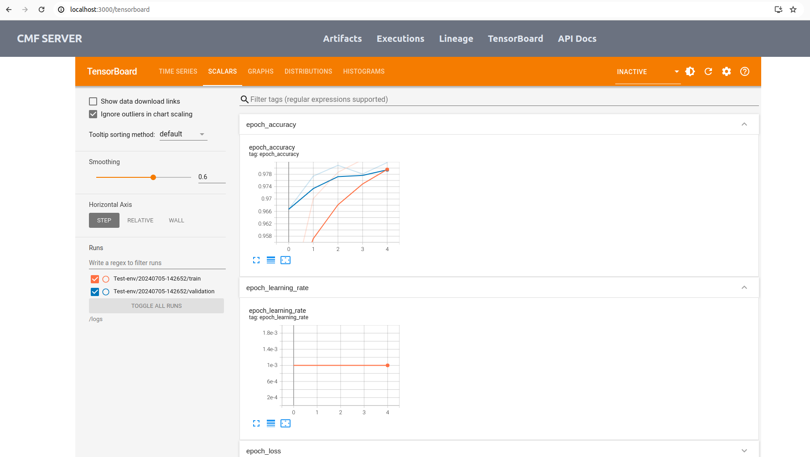

# How to Use TensorBoard with CMF

1. Copy the contents of the `example-get-started` directory from  
	`cmf/examples/example-get-started` into a separate directory outside the CMF repository.

2. Execute the following command to install the TensorFlow library in the
	current directory:
  	```bash
  	pip install tensorflow
  	```

3. Create a new Python file (e.g., `tensorflow_log.py`) and copy the following code:

	```python
	import datetime
	import tensorflow as tf

	mnist = tf.keras.datasets.mnist
	(x_train, y_train), (x_test, y_test) = mnist.load_data()
	x_train, x_test = x_train / 255.0, x_test / 255.0

	def create_model():
		 return tf.keras.models.Sequential([
			  tf.keras.layers.Flatten(input_shape=(28, 28), name='layers_flatten'),
			  tf.keras.layers.Dense(512, activation='relu', name='layers_dense'),
			  tf.keras.layers.Dropout(0.2, name='layers_dropout'),
			  tf.keras.layers.Dense(10, activation='softmax', name='layers_dense_2')
		 ])

	model = create_model()
	model.compile(
		 optimizer='adam',
		 loss='sparse_categorical_crossentropy',
		 metrics=['accuracy']
	)

	log_dir = "logs/fit/" + datetime.datetime.now().strftime("%Y%m%d-%H%M%S")
	tensorboard_callback = tf.keras.callbacks.TensorBoard(log_dir=log_dir, histogram_freq=1)
	model.fit(x=x_train,y=y_train,epochs=5,validation_data=(x_test, y_test),callbacks=[tensorboard_callback])

	train_dataset = tf.data.Dataset.from_tensor_slices((x_train, y_train))
	test_dataset = tf.data.Dataset.from_tensor_slices((x_test, y_test))

	train_dataset = train_dataset.shuffle(60000).batch(64)
	test_dataset = test_dataset.batch(64)

	loss_object = tf.keras.losses.SparseCategoricalCrossentropy()
	optimizer = tf.keras.optimizers.Adam()

	# Define our metrics
	train_loss = tf.keras.metrics.Mean('train_loss', dtype=tf.float32)
	train_accuracy = tf.keras.metrics.SparseCategoricalAccuracy('train_accuracy')
	test_loss = tf.keras.metrics.Mean('test_loss', dtype=tf.float32)
	test_accuracy = tf.keras.metrics.SparseCategoricalAccuracy('test_accuracy')

	def train_step(model, optimizer, x_train, y_train):
		 with tf.GradientTape() as tape:
			  predictions = model(x_train, training=True)
			  loss = loss_object(y_train, predictions)
		 grads = tape.gradient(loss, model.trainable_variables)
		 optimizer.apply_gradients(zip(grads, model.trainable_variables))
		 train_loss(loss)
		 train_accuracy(y_train, predictions)

	def test_step(model, x_test, y_test):
		 predictions = model(x_test)
		 loss = loss_object(y_test, predictions)
		 test_loss(loss)
		 test_accuracy(y_test, predictions)

	current_time = datetime.datetime.now().strftime("%Y%m%d-%H%M%S")
	train_log_dir = 'logs/gradient_tape/' + current_time + '/train'
	test_log_dir = 'logs/gradient_tape/' + current_time + '/test'
	train_summary_writer = tf.summary.create_file_writer(train_log_dir)
	test_summary_writer = tf.summary.create_file_writer(test_log_dir)

	model = create_model()  # reset our model
	EPOCHS = 5
	for epoch in range(EPOCHS):
		 for (x_batch, y_batch) in train_dataset:
			  train_step(model, optimizer, x_batch, y_batch)
		 with train_summary_writer.as_default():
			  tf.summary.scalar('loss', train_loss.result(), step=epoch)
			  tf.summary.scalar('accuracy', train_accuracy.result(), step=epoch)

		 for (x_batch, y_batch) in test_dataset:
			  test_step(model, x_batch, y_batch)
		 with test_summary_writer.as_default():
			  tf.summary.scalar('loss', test_loss.result(), step=epoch)
			  tf.summary.scalar('accuracy', test_accuracy.result(), step=epoch)
		 template = 'Epoch {}, Loss: {}, Accuracy: {}, Test Loss: {}, Test Accuracy: {}'
		 print(template.format(
			  epoch + 1,
			  train_loss.result(),
			  train_accuracy.result() * 100,
			  test_loss.result(),
			  test_accuracy.result() * 100
		 ))
	```

	For more detailed information, check out the [TensorBoard documentation](https://www.tensorflow.org/tensorboard/get_started).

4. Execute the TensorFlow log script using the following command:
	```bash
	python3 tensorflow_log.py
	```

5. The above script will automatically create a `logs` directory inside your current directory.

6. Start the [CMF Server](./../setup/index.md#install-cmf-server-with-gui) and configure the [CMF Client](index.md).

7. Use the following command to run the test script, which will generate the MLMD file:
	```bash
	sh test_script.sh
	```
	`Note` - `MLMD` stands for ML Metadata, which is typically stored as a SQLite file generated during pipeline runs. The file extension and name may vary depending on your setup.

8. Use the following command to push the generated MLMD and TensorFlow log files to the CMF server:
	```bash
	cmf metadata push -p 'pipeline-name' -t 'tensorboard-log-file-name'
	```

9. Go to the CMF server and navigate to the TensorBoard tab. You will see an interface similar to the following image:  
	

---
