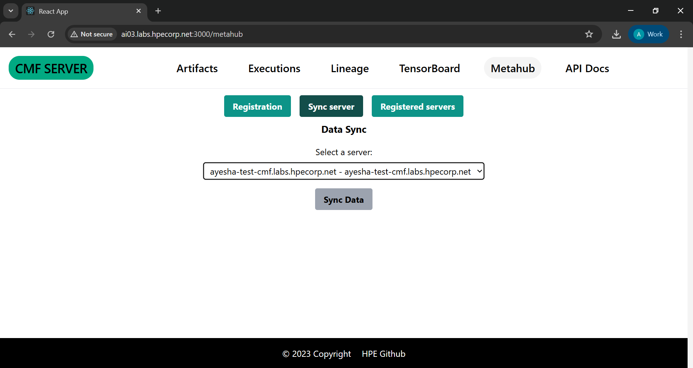

# Introduction to Metahub Feature 

The **Metahub** feature is introduced to **synchronize metadata between two CMF servers**. This document explains how to use this feature effectively via the GUI.

---

## Steps to Use Metahub feature

### 1. Start the CMF Server
Ensure that the CMF server is up and running. You can follow the document below.

[Guide to start CMF Server](./../setup/index.md#install-cmf-server-with-gui)

---

### 2. Navigate to Metahub Tab

In the GUI, locate and click the **Metahub** tab from the navigation panel.

> After clicking the Metahub tab, you will see two tabs:

- **Registration** → Register a new server for syncing.
- **Registered Servers** → View the list of registered servers and perform sync with registered servers.

---

## Registration Tab

The **Registration** tab allows you to register another server that you want to sync with.

### Functionality:
1. Register the target server you want to sync with.
2. You can provide:
      - Server Name  
      **AND**  
      - Server URL
3. Click **Submit**. You’ll receive a message confirming whether the server registration was successful.

---

## Registered Servers Tab

This section displays all registered servers in a table format.

### Functionality:
1. View the list of all registered target servers.
2. The table includes a **`last_sync_time`** column to indicate when each server was last successfully synced.
3. You can **`Sync`** the current server with registered servers.

---

> Make sure all servers involved are running and reachable via the provided IP or hostname.
