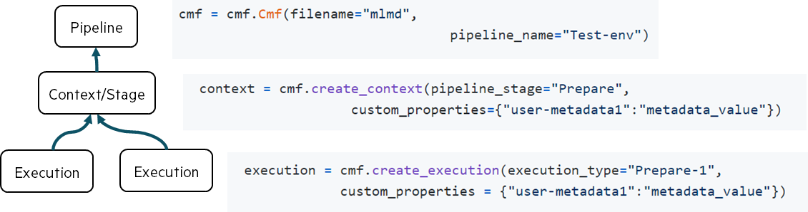

# cmflib

The `cmflib` package is the foundational Python library that provides the core metadata tracking capabilities for the Common Metadata Framework (CMF). It offers a unified API for logging metadata across distributed AI/ML pipelines, integrating with multiple storage backends and versioning systems.

This document covers the core library components, main API classes, and integration mechanisms. For CLI usage patterns, see [Quick Start with CMF Client](../cmf_client/index.md). For server-side components, see [CMF Server](../setup/index.md#install-cmf-server-with-gui).

## Core Architecture

**Note:** The CMF library should be imported as `from cmflib.cmf import Cmf`. See examples below for the correct usage pattern.

Complex ML projects rely on `ML pipelines` to train and test ML models. An ML pipeline is a sequence of stages where
each stage performs a particular task, such as data loading, pre-processing, ML model training, and testing stages.
Each stage can have multiple Executions which:

- consume `inputs` and produce `outputs`.
- are parameterized by parameters that guide the process of producing outputs.


CMF uses the abstractions of `Pipeline`, `Context`, and `Executions` to store the metadata of complex ML pipelines.
Each pipeline has a name. Users provide it when they initialize the CMF. Each stage is represented by a `Context` object.
Metadata associated with each <u>run</u> of a <u>stage</u> is captured in the Execution object.
Inputs and outputs of Executions can be logged as dataset, model, or metrics. While parameters of executions
are recorded as properties of executions.



## Main API

The `Cmf` class is the primary interface for metadata tracking in CMF. It provides methods for creating pipelines, contexts, executions, and logging artifacts.

### Key Methods

| Method | Purpose | Usage |
|--------|---------|-------|
| `__init__(filepath, pipeline_name)` | Initialize CMF instance | `metawriter = Cmf(filepath="mlmd", pipeline_name="my_pipeline")` |
| `create_context(pipeline_stage)` | Create a pipeline stage context | `context = metawriter.create_context(pipeline_stage="train")` |
| `create_execution(execution_type)` | Create an execution within a context | `execution = metawriter.create_execution(execution_type="training_run")` |
| `log_dataset(url, event, custom_properties)` | Log dataset artifacts | `metawriter.log_dataset(url="data.csv", event="input")` |
| `log_model(path, event, model_framework)` | Log model artifacts | `metawriter.log_model(path="model.pkl", event="output")` |
| `log_metrics(metrics_name, custom_properties)` | Log metrics | `metawriter.log_metrics(metrics_name="accuracy", custom_properties={"value": 0.95})` |

<table markdown="block" style="border: 0">
<tbody markdown="block" style="width: 100%; display: table">
<tr markdown="block">
<td markdown="block">

=== "1 Init"
    Start tracking the pipeline metadata by initializing the CMF runtime. The metadata will be associated with the
    pipeline named `test_pipeline`.
    ```python
    from cmflib.cmf import Cmf
    from ml_metadata.proto import metadata_store_pb2 as mlpb

    metawriter = Cmf(
        filepath="mlmd",
        pipeline_name="test_pipeline",
    )
    ```

=== "2 Stage type"
    Before we can start tracking metadata, we need to let CMF know about the stage type. This is not yet associated with
    this particular execution.
    ```python
    context: mlmd.proto.Context = metawriter.create_context(
        pipeline_stage="train"
    )
    ```

=== "3 New execution"
    Now we can create a new stage execution associated with the `train` stage. The CMF always creates a new execution,
    and will adjust its name, so it's unique. This is also the place where we can log execution `parameters` like seed, hyper-parameters, etc.
    ```python
    execution: mlmd.proto.Execution = metawriter.create_execution(
        execution_type="train",
        custom_properties = {"num_epochs": 100, "learning_rate": 0.01}
    )
    ```

=== "4 Log Artifacts"
    Finally, we can log an input (train dataset), and once trained, an output (ML model) artifact.
    ```python
    metawriter.log_dataset(
        'artifacts/test_dataset.csv',   # Dataset path
        "input"                         # This is INPUT artifact
    )
    metawriter.log_model(
        "artifacts/model.pkl",          # Model path
        event="output"                  # This is OUTPUT artifact
    )
    ```


</td>
<td style="text-align: right; width: 450px">

</td>
</tr>
</tbody>
</table>

## Quick Example
Go through the [Getting Started](../examples/getting_started.md) page to learn more about CMF API usage.

## API Overview

**Import CMF**.
```python
from cmflib.cmf import Cmf
```

**Initialize CMF**. The [CMF][cmflib.cmf.Cmf] object is responsible for managing a CMF backend to record
the pipeline metadata. Internally, it creates a pipeline abstraction that groups individual stages and their executions.
All stages, their executions, and produced artifacts will be associated with a pipeline with the given name.
```python
metawriter = Cmf(
   filepath="mlmd",                # Path to ML Metadata file.
   pipeline_name="mnist"           # Name of an ML pipeline.
)
```

**Define a stage**. An ML pipeline can have multiple stages, and each stage can be associated with multiple executions.
A stage is described by a context, which specifies its name and optional properties. You can create a context using the
[create_context][cmflib.cmf.Cmf.create_context] method:
```python
context = metawriter.create_context(
    pipeline_stage="download",     # Stage name
    custom_properties={            # Optional properties
        "uses_network": True,      #  Downloads from the Internet
        "disk_space": "10GB"       #  Needs this much space
    }
)
```

**Create a stage execution**. A stage in an ML pipeline can have multiple executions. Every run is marked as an execution.
This API helps to track the metadata associated with the execution, like stage parameters (e.g., number of epochs and
learning rate for train stages). The stage execution name does not need to be the same as the name of its context.
Moreover, the CMF will adjust this name to ensure every execution has a unique name. The CMF will internally associate
this execution with the context created previously. Stage executions are created by calling the
[create_execution][cmflib.cmf.Cmf.create_execution] method.
```python
execution = metawriter.create_execution(
    execution_type="download",            # Execution name.
    custom_properties = {                 # Execution parameters
        "url": "https://a.com/mnist.gz"   #  Data URL.
    }
)
```

**Log artifacts**. A stage execution can consume (inputs) and produce (outputs) multiple artifacts (datasets, models, and
performance metrics). The path of these artifacts must be relative to the project (repository) root path. Artifacts
might have optional metadata associated with them. This metadata could include feature statistics for ML datasets, or useful parameters for ML models (such as, for
instance, number of trees in a random forest classifier).

- **Datasets** are logged with the [log_dataset][cmflib.cmf.Cmf.log_dataset] method.
    ```python
    metawriter.log_dataset('data/mnist.gz', "input", custom_properties={"name": "mnist", "type": 'raw'})
    metawriter.log_dataset('data/train.csv', "output", custom_properties={"name": "mnist", "type": "train_split"})
    metawriter.log_dataset('data/test.csv', "output", custom_properties={"name": "mnist", "type": "test_split"})
    ```

- **ML models** produced by training stages are logged using the [log_model][cmflib.cmf.Cmf.log_model] API. ML models can be
  both input and output artifacts. The metadata associated with the artifact could be logged as an optional argument.
    ```python
    # In train stage
    metawriter.log_model(
       path="model/rf.pkl", event="output", model_framework="scikit-learn", model_type="RandomForestClassifier",
       model_name="RandomForestClassifier:default"
    )

    # In test stage
    metawriter.log_model(
       path="model/rf.pkl", event="input"
    )
    ```

- **Metrics** of every optimization step (one epoch of Stochastic Gradient Descent, or one boosting round in
  Gradient Boosting Trees) are logged using the [log_metric][cmflib.cmf.Cmf.log_metric] API.
    ```python
    # Can be called at every epoch or every step in the training. This is logged to a parquet file and committed at the
    # commit stage.

    # Inside training loop
    while True:
         metawriter.log_metric("training_metrics", {"loss": loss})
    metawriter.commit_metrics("training_metrics")
    ```

- **Stage metrics**, or final metrics, are logged with the [log_execution_metrics][cmflib.cmf.Cmf.log_execution_metrics]
  method. These are final metrics of a stage, such as final train or test accuracy.
    ```python
    metawriter.log_execution_metrics("metrics", {"avg_prec": avg_prec, "roc_auc": roc_auc})
    ```

**Dataslices** are intended to be used to track subsets of the data. For instance, this can be used to track and compare
accuracies of ML models on these subsets to identify model bias. [Data slices][cmflib.cmf.Cmf.DataSlice] are created with
the [create_dataslice][cmflib.cmf.Cmf.create_dataslice] method.
```python
dataslice = metawriter.create_dataslice("slice-a")
for i in range(1, 20, 1):
    j = random.randrange(100)
    dataslice.add_data("data/raw_data/"+str(j)+".xml")
dataslice.commit()
```

## Graph Layer Overview
The CMF library has an optional `graph layer` which stores the relationships in a Neo4J graph database. To use the graph
layer, the `graph` parameter in the library init call must be set to true (it is set to false by default). The
library reads the configuration parameters of the graph database from the `cmf config` generated by the `cmf init` command.

**Basic Usage (Required Parameters Only):**
```
cmf init local --path /path/to/local-storage --git-remote-url https://github.com/user/experiment-repo.git
```

**With Optional Parameters:**
```
cmf init local --path /path/to/local-storage --git-remote-url https://github.com/user/experiment-repo.git --cmf-server-url http://x.x.x.x:80 --neo4j-user neo4j --neo4j-password password --neo4j-uri bolt://localhost:7687
```

To use the graph layer, instantiate the CMF with the `graph=True` parameter:
```python
from cmflib.cmf import Cmf

metawriter =  Cmf(
   filepath="mlmd",
   pipeline_name="anomaly_detection_pipeline",
   graph=True
)
```
