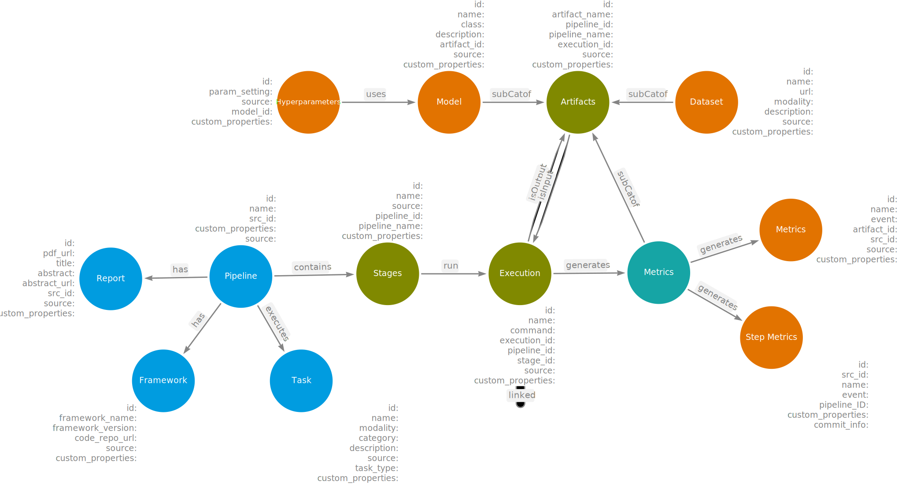

## Common Metadata Ontology
Common Metadata Ontology(CMO), formalization of AI-MKG, was proposed to integrate and aggregate the pipeline metadata from various sources such as Papers-with-code, OpenML and Huggingface. The CMO is adapted from CMF which is designed to caputre the pipeline-centric metadata of AI pipelines. It consists of nodes to represent various components of a pipeline, relationships to capture interaction amongpipeline entities and properties for each node. CMO offers interoperability of diverse metadata, search and recommendation with reasoning capabilities. It follows a pipeline-centric approach that captures the process workflow of the pipelines. It offers flexibility to incorporate various executions implemented for each stage such as dataset preprocessing, feature engineering, training, testing and evaluations. This enables robust search capabilities to identify the best execution path for a given pipeline. Additionally, CMO also facilitates the inclusion of additional semantic and statistical properties to enhance the richness and comprehensiveness of the metadata associated with them. The overview of CMO can be found below.

### Sample pipeline represented using CMO

#### Turtle Syntax
The Turtle format of formal ontology can be found [here](cmo_v2.ttl)

#### Properties of each nodes
The properties of each node can be found below.

##### Pipeline
AI pipeline executed to solve a machine or deep learning Task
###### Properties
* pipeline_id
* pipeline_name
* pipeline_source
* source_id
* custom_properties*

##### Report
Any published text document regarding the pipeline implementation
###### Properties
* report_id
* report_title
* report_pdf_url
* source
* source_id
* abstract*
* custom_properties*

##### Task
The AI Task for which the pipeline is implemented. Example: image classification
###### Properties
* task_id
* task_name
* task_description
* task_type
* modality
* category
* source
* custom_properties*

##### Framework
The framework used to implement the pipeline and their code repository
###### Properties
* framework_id
* framework_name
* code_repo_url
* framework_version
* source

##### Stage
Various stages of the pipeline such as data preprocessing, training, testing or evaluation
###### Properties
* stage_id
* stage_name
* source
* pipeline_id
* pipeline_name
* custom_properties

##### Execution
Multiple executions of a given stage in a pipeline
###### Properties
* execution_id
* execution_name
* stage_id
* stage_name
* pipeline_id
* pipeline_name
* source
* command (CLI command to run the execution)
* custom_properties

##### Artifact
Artifacts such as model, dataset and metric generated at the end of each execution
###### Properties
* artifact_id
* artifact_name
* pipeline_id
* pipeline_name
* execution_id
* source
* custom_properties

##### Dataset
Subclass of artifact. The dataset used in each Execution of a Pipeline
###### Properties
* dataset_id
* dataset_name
* dataset_url
* modality
* description
* source
* custom_properties

##### Model
Subclass of artifact. The model used in each execution or produced as a result of an execution
###### Properties
* model_id
* model_name
* model_class
* description
* artifact_id
* source
* custom_properties

##### Metric
Subclass of artifact. The evaluation result of each execution
###### Properties
* metric_id
* metric_name
* artifact_id
* evaluations
* source
* custom_properties**

##### Hyperparameters
Parameter setting using for each Execution of a Stage
###### Properties
* parameter_id
* parameter_setting (key-value pair)
* source
* model_id
* custom_properties

NOTE: 
* *are optional properties
* There additional information on each node, different for each source. As of now, there are included in the KG for efficient search. But they are available to be used in the future to extract the data and populate as node properties.
* **For metric, there are umpteen possible metric names and values. Therefore, we capture all of them as a key value pair under evaluations
* custom_properties are where user can enter custom properties for each node while executing a pipeline
* source is the source from which the node is obtained - papers-with-code, openml, huggingface

