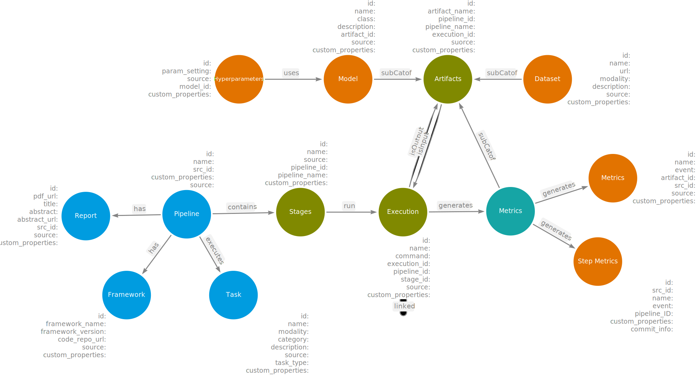
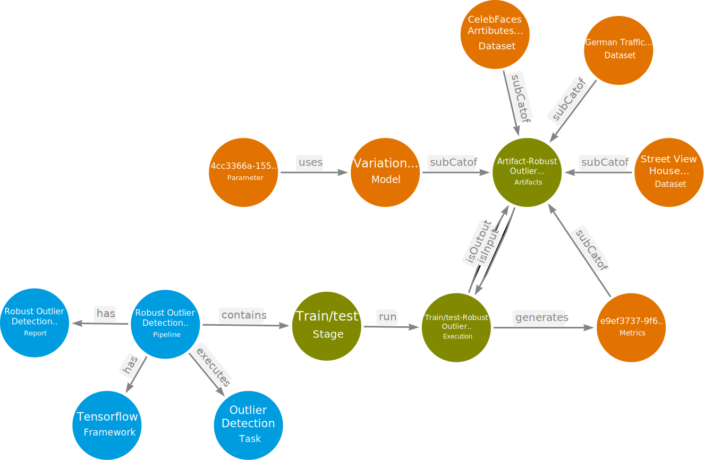

## Common Metadata Ontology
Common Metadata Ontology (CMO) integrates and aggregates pipeline metadata
from various sources such as Papers-with-Code, OpenML, and Hugging Face. CMF's
data model is a manifestation of CMO, specifically designed to capture
the pipeline-centric metadata of AI pipelines. It consists of nodes to represent
a pipeline, components of a pipeline (stages), relationships to capture
interactions among pipeline entities, and properties. CMO offers interoperability
of diverse metadata, search, and recommendation with reasoning capabilities. CMO
offers flexibility to incorporate various executions implemented for each stage,
such as dataset preprocessing, feature engineering, training (including
hyperparameter optimization), testing, and evaluation. This enables robust search
capabilities to identify the best execution path for a given pipeline.
Additionally, CMO also facilitates the inclusion of additional semantic and
statistical properties to enhance the richness and comprehensiveness of the
metadata associated with them. An overview of CMO can be found below.

The external link to arrows.app can be found [here](https://drive.google.com/file/d/1h4tcOnQpHC3Jx2lWh8ecXW7BcM5yH3XK/view?usp=sharing)

### Sample pipeline represented using CMO

The sample figure shows a pipeline titled "Robust outlier detection by
de-biasing VAE likelihoods" executed for the "Outlier Detection" task, focusing
on the stage train/test. The model used in the pipeline was "Variational
Autoencoder". Several datasets were used in the pipeline:

- German Traffic Sign
- Street View House Numbers
- CelebFaces Attributes dataset.

The corresponding hyperparameters used and the metrics generated as a result of
execution are included in the figure. The external link to the source figure created
using arrows.app can be found
[here](https://drive.google.com/file/d/1oa3tKMKZlmDFI0sBcIkWZdW4LS4P6WMs/view?usp=sharing)

#### Turtle Syntax
The Turtle format of the formal ontology can be found [here](cmo_v2.ttl)

#### Properties of each node
The properties of each node can be found below.

##### Pipeline
AI pipeline executed to solve a machine or deep learning task
###### Properties
* pipeline_id
* pipeline_name
* pipeline_source
* source_id
* custom_properties*

##### Report
Any published text document regarding the pipeline implementation
###### Properties
* report_id
* report_title
* report_pdf_url
* source
* source_id
* abstract*
* custom_properties*

##### Task
The AI task for which the pipeline is implemented. Example: image classification
###### Properties
* task_id
* task_name
* task_description
* task_type
* modality
* category
* source
* custom_properties*

##### Framework
The framework used to implement the pipeline and its code repository
###### Properties
* framework_id
* framework_name
* code_repo_url
* framework_version
* source

##### Stage
Various stages of the pipeline, such as data preprocessing, training, testing, or evaluation
###### Properties
* stage_id
* stage_name
* source
* pipeline_id
* pipeline_name
* custom_properties

##### Execution
Multiple executions of a given stage in a pipeline
###### Properties
* execution_id
* execution_name
* stage_id
* stage_name
* pipeline_id
* pipeline_name
* source
* command (CLI command to run the execution)
* custom_properties

##### Artifact
Artifacts such as model, dataset, and metric generated at the end of each execution
###### Properties
* artifact_id
* artifact_name
* pipeline_id
* pipeline_name
* execution_id
* source
* custom_properties

##### Dataset
Subclass of artifact. The dataset used in each execution of a pipeline
###### Properties
* dataset_id
* dataset_name
* dataset_url
* modality
* description
* source
* custom_properties

##### Model
Subclass of artifact. The model used in each execution or produced as a result of an execution
###### Properties
* model_id
* model_name
* model_class
* description
* artifact_id
* source
* custom_properties

##### Metric
Subclass of artifact. The evaluation result of each execution
###### Properties
* metric_id
* metric_name
* artifact_id
* evaluations
* source
* custom_properties**

##### Hyperparameters
Parameter settings used for each execution of a stage
###### Properties
* parameter_id
* parameter_setting (key-value pair)
* source
* model_id
* custom_properties

NOTE:
* *are optional properties
* There is additional information on each node, different for each source. As of now, these are included in the KG for efficient search, but they are available to be used in the future to extract the data and populate as node properties.
* **For metric, there are umpteen possible metric names and values. Therefore, we capture all of them as a key-value pair under evaluations.
* custom_properties are where users can enter custom properties for each node while executing a pipeline.
* source is the source from which the node is obtained - Papers-with-Code, OpenML, Hugging Face.

### Published works
* R. Venkataramanan, A. Tripathy, M. Foltin, H. Y. Yip, A. Justine, and A. Sheth, "Knowledge Graph Empowered Machine Learning Pipelines for Improved Efficiency, Reusability, and Explainability," in IEEE Internet Computing, vol. 27, no. 1, pp. 81-88, 1 Jan.-Feb. 2023, doi: 10.1109/MIC.2022.3228087. Link: https://www.computer.org/csdl/magazine/ic/2023/01/10044293/1KL6TPO5huw

#### Related works
* Publio, G. C., Esteves, D., Ławrynowicz, A., Panov, P., Soldatova, L., Soru, T., ... & Zafar, H. (2018). ML-schema: exposing the semantics of machine learning with schemas and ontologies. arXiv preprint arXiv:1807.05351. Link - http://ml-schema.github.io/documentation/ML%20Schema.html
* Nguyen, A., Weller, T., Färber, M., & Sure-Vetter, Y. (2020). Making neural networks fair. In Knowledge Graphs and Semantic Web: Second Iberoamerican Conference and First Indo-American Conference, KGSWC 2020, Mérida, Mexico, November 26–27, 2020, Proceedings 2 (pp. 29-44). Springer International Publishing. Link - https://arxiv.org/pdf/1907.11569.pdf
* Humm, B. G., & Zender, A. (2021). An ontology-based concept for meta AutoML. In Artificial Intelligence Applications and Innovations: 17th IFIP WG 12.5 International Conference, AIAI 2021, Hersonissos, Crete, Greece, June 25–27, 2021, Proceedings 17 (pp. 117-128). Springer International Publishing. Link - https://www.researchgate.net/profile/Alexander-Zender-2/publication/352574909_An_Ontology-Based_Concept_for_Meta_AutoML/links/619691e107be5f31b796d2fd/An-Ontology-Based-Concept-for-Meta-AutoML.pdf
