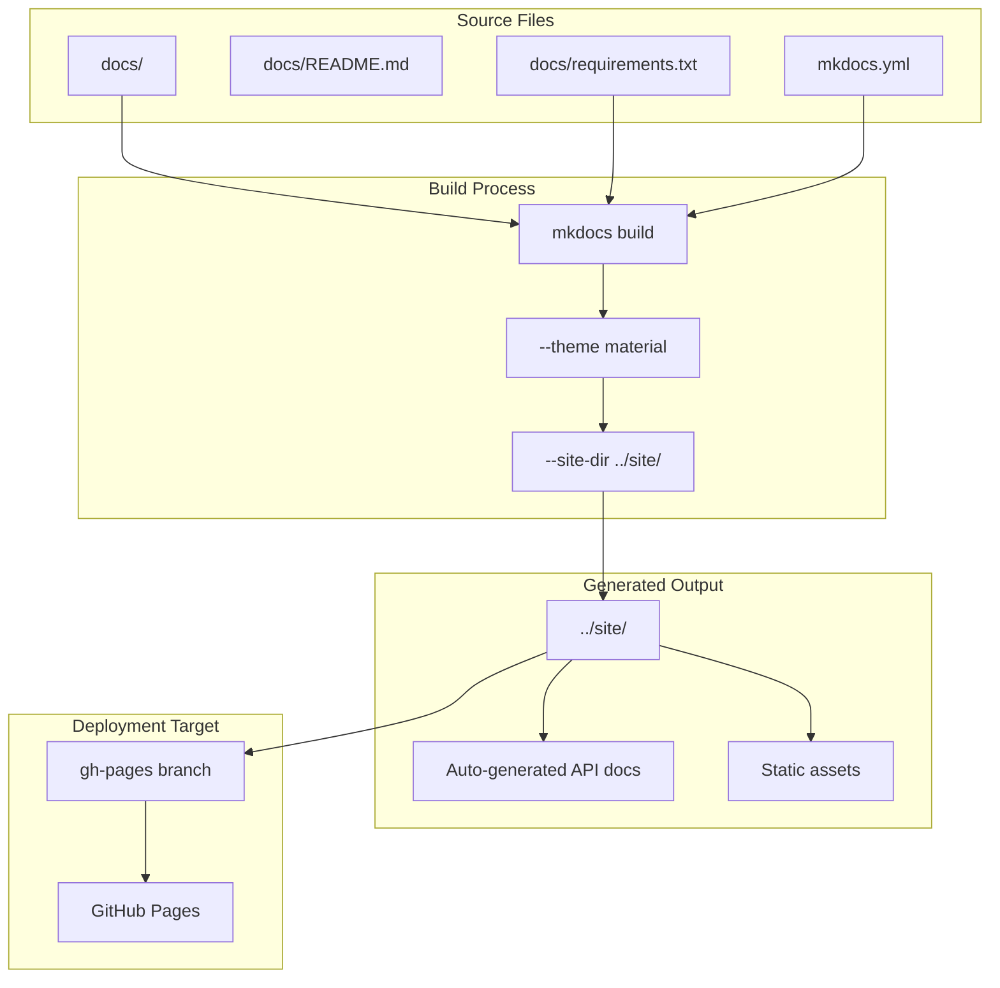
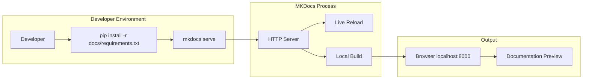
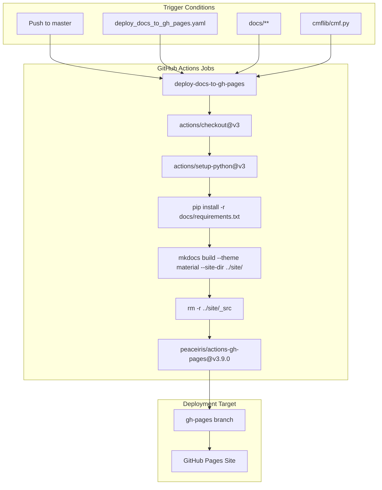

# Documentation System

## Purpose and Scope

The CMF documentation system provides automated building and deployment of project documentation using MKDocs. This system handles the generation of API documentation, deployment to GitHub Pages, and local development workflows for documentation contributors.

## MKDocs-Based Documentation

CMF uses [MKDocs](https://www.mkdocs.org/) as its primary documentation framework with the Material theme. The documentation system automatically generates API documentation and maintains a comprehensive wiki-style documentation site.

### Documentation Architecture



## Local Development Workflow

Developers can build and serve documentation locally using the following process:

### Prerequisites and Commands

| Command | Purpose |
|---------|---------|
| `pip install -r docs/requirements.txt` | Install documentation dependencies |
| `mkdocs serve` | Start local development server |

### Local Build Process



## GitHub Actions Deployment Pipeline

The documentation system uses GitHub Actions for automated deployment to GitHub Pages through the workflow defined in `.github/workflows/deploy_docs_to_gh_pages.yaml`.

### Deployment Workflow



### Workflow Configuration Details

The deployment workflow includes specific configuration parameters:

| Parameter | Value | Purpose |
|-----------|-------|---------|
| `python-version` | `'3.10'` | Python environment version |
| `working-directory` | `'./'` | Build execution directory |
| `site-dir` | `../site/` | Output directory for built docs |
| `publish_dir` | `../site` | Directory published to GitHub Pages |
| `github_token` | `${{ secrets.GITHUB_TOKEN }}` | Authentication for deployment |

### Build Trigger Paths

The workflow is triggered by changes to these specific paths:

- `.github/workflows/deploy_docs_to_gh_pages.yaml` - The workflow file itself
- `docs/**` - Documentation source files (excluding `docs/_src/**`)
- `cmflib/cmf.py` - Public API documentation source

## Repository Access Control

The deployment workflow includes security measures to prevent execution on forked repositories:

```yaml
if: github.repository_owner == 'HewlettPackard'
```

This condition ensures the workflow only runs on the official HPE repository, preventing unauthorized deployments from forks.

## File Cleanup Process

The build process includes automatic cleanup of raw documentation assets:

```bash
rm -r ../site/_src
```

This removes the `_src` directory containing raw files that are not needed for the deployed documentation site, optimizing the final deployment size.

## Best Practices

### Documentation Writing

1. **Use Mermaid diagrams** for architectural and flow diagrams
2. **Include code examples** with proper syntax highlighting
3. **Cross-reference sections** using internal links
4. **Keep content modular** with focused, single-purpose pages

### File Organization

1. **Group related content** in subdirectories
2. **Use descriptive filenames** that match navigation structure
3. **Include assets** in the `assets/` directory
4. **Maintain consistent** markdown formatting

### Development Workflow

1. **Test locally** before committing changes
2. **Use live reload** during development with `mkdocs serve`
3. **Check build logs** in GitHub Actions for deployment issues
4. **Review generated site** after deployment
