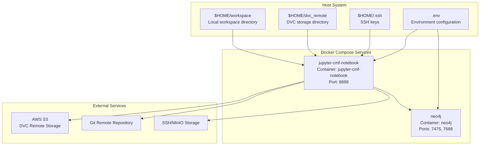

# Development Environment

This document covers the containerized development environment setup for CMF using Docker Compose and Jupyter notebooks. The development environment provides a complete, isolated setup with CMF pre-installed, Neo4j graph database, and pre-configured connections to external storage systems.

## Overview

The CMF development environment is built using Docker Compose to orchestrate multiple services including a Jupyter notebook server with CMF pre-installed and a Neo4j graph database. This setup enables developers to experiment with CMF functionality without complex local installations.

### Development Environment Architecture



## Docker Compose Configuration

The development environment is defined in `docker-compose.yml` which orchestrates two main services:

### Jupyter CMF Notebook Service

The primary development container runs a Jupyter Lab environment with CMF pre-installed:

- **Build Context**: Uses local `Dockerfile` in current directory
- **Container Name**: `jupyter-cmf-notebook`
- **Port Mapping**: Host port 8888 maps to container port 8888
- **User Configuration**: Runs as root with environment variables for user setup

### Neo4j Database Service

A Neo4j graph database service provides graph storage capabilities:

- **Image**: `neo4j:5.26`
- **Container Name**: `neo4j`
- **Port Mappings**: 
  - HTTP interface: 7475 → 7474
  - Bolt protocol: 7688 → 7687
- **Authentication**: Configured via `NEO4J_USER_NAME` and `NEO4J_PASSWD`

## Container Image Build Process

The Jupyter container is built using a multi-stage process defined in the `Dockerfile`:

### Base Image and Dependencies

Key build steps:

1. **Base Image**: Uses `jupyter/tensorflow-notebook` for ML capabilities
2. **Conda Environment**: Installs `nb_conda_kernels` for kernel management
3. **Requirements Installation**: Installs Python dependencies from `Requirements.txt`
4. **CMF Installation**: Copies and installs the CMF library from source
5. **Examples**: Copies example notebooks to `/home/${NB_USER}/example-get-started`

## Volume Mounts and Data Persistence

The development environment uses volume mounts to persist data and provide access to host resources:

### Volume Configuration

Volume mappings defined in docker-compose.yml:

- **Workspace**: `$HOME/workspace:/home/jovyan/workspace`
- **DVC Remote**: `$HOME/dvc_remote:/home/jovyan/dvc_remote`
- **SSH Keys**: `$HOME/.ssh:/home/jovyan/.ssh`

**Prerequisites**: Users must create these directories before running:
```bash
mkdir $HOME/workspace
mkdir $HOME/dvc_remote
```

## Environment Variables Configuration

The development environment supports extensive configuration through environment variables loaded from a `.env` file:

### Key Environment Variables

**AWS Integration**:
- `AWS_ACCESS_KEY_ID` and `AWS_SECRET_ACCESS_KEY`
- `DVC_REMOTE_URL` for DVC storage backend

**Git Integration**:
- `GIT_USER_NAME`, `GIT_USER_EMAIL`
- `GIT_REMOTE_URL`, `GIT_BRANCH`

**Database Configuration**:
- `DB_URL=mysql://db:33060`
- `DB_PASSWORD` from MySQL root password

**Neo4j Integration**:
- `NEO4J=TRUE` to enable Neo4j support
- `NEO4J_URI=bolt://neo4j:7687`
- `NEO4J_USER_NAME`, `NEO4J_PASSWD`

## Jupyter Lab Configuration

The Jupyter environment is configured with specific settings for CMF development:

### Jupyter Configuration

- **Jupyter Command**: `DOCKER_STACKS_JUPYTER_CMD=lab`
- **Default Token**: `JUPYTER_TOKEN=docker`
- **Lab Enabled**: `JUPYTER_ENABLE_LAB=yes`

### User Environment Setup

The container uses dynamic user configuration to match host permissions through environment variables like `NB_USER`, `NB_UID`, `NB_GID`, etc.

## Getting Started

To use the development environment:

1. **Create required directories**:
   ```bash
   mkdir $HOME/workspace
   mkdir $HOME/dvc_remote
   ```

2. **Create `.env` file** with required environment variables

3. **Start services**:
   ```bash
   docker-compose up
   ```

4. **Access Jupyter Lab** at `http://localhost:8888` with token `docker`

5. **Access Neo4j browser** at `http://localhost:7475`

The development environment provides a complete CMF installation with example notebooks available in the `example-get-started` directory.
