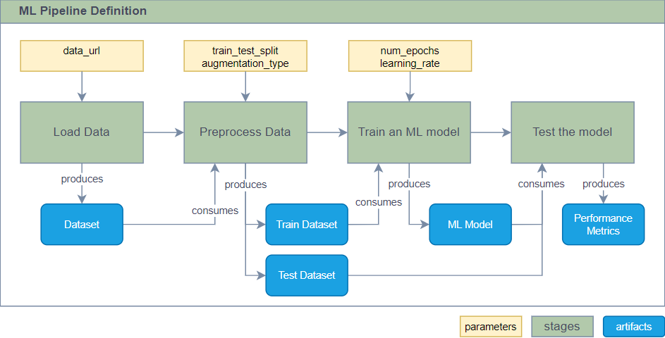
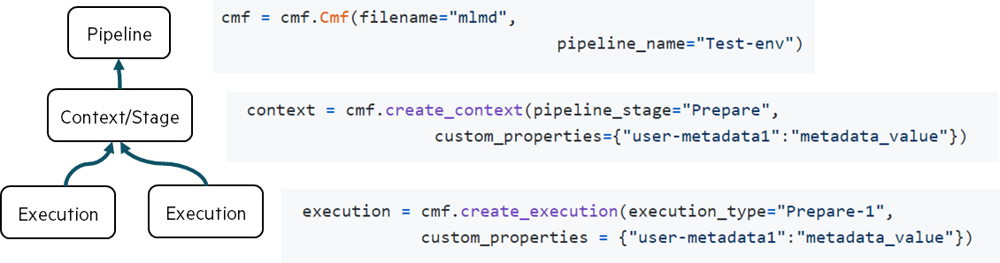
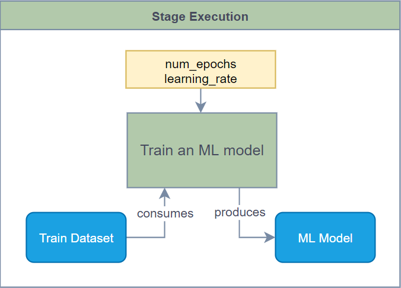
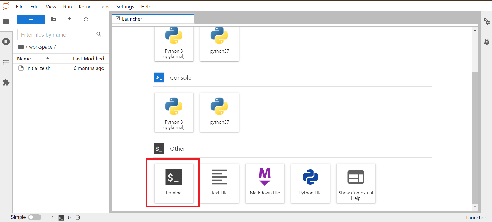
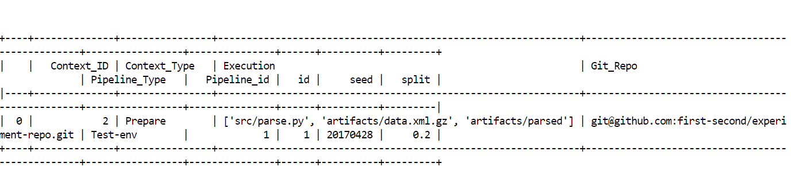
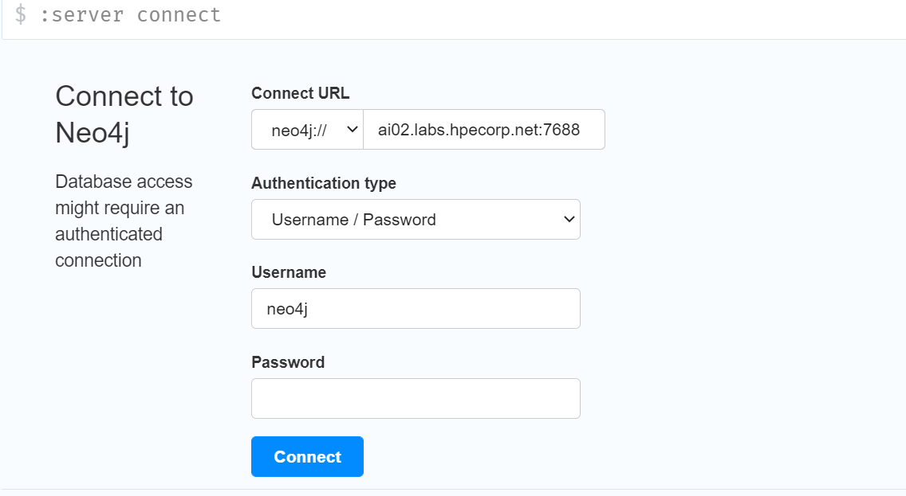
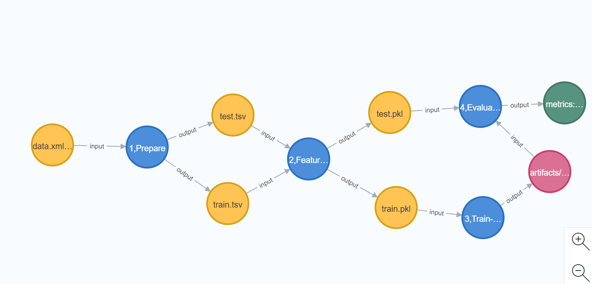
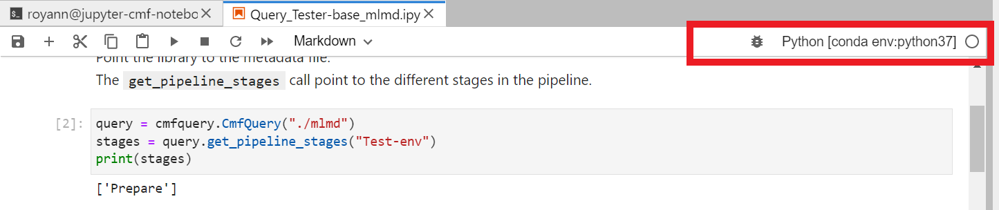
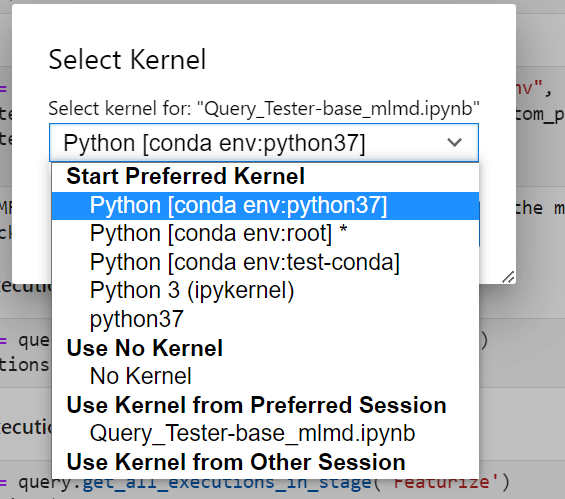

# CMF in a nutshell

CMF (Common Metadata Framework) collects and stores information associated with Machine Learning (ML) pipelines. It 
also implements APIs to query this metadata. The CMF adopts a data-first approach: all artifacts (such as datasets, ML
models and performance metrics) recorded by the framework are versioned and identified by their content hash.

## Installation

#### 1. Pre-Requisites:
* 3.9>= Python <3.11
* Git latest version

#### 2. Set up Python Virtual Environment:

=== "Using Conda"
    ```shell
    conda create -n cmf python=3.10
    conda activate cmf
    ```

=== "Using VirtualEnv" 
    ```shell
    virtualenv --python=3.10 .cmf
    source .cmf/bin/activate
    ```

#### 3. Install CMF:

=== "Latest version form GitHub"
    ```shell
    pip install git+https://github.com/HewlettPackard/cmf
    ```

=== "Stable version form PyPI"
    ```shell    
    # pip install cmflib
    ```
## Next Steps

After installing CMF, proceed to configure CMF server and client. For detailed configuration instructions, refer to the [Quick start with cmf-client](./cmf_client/step-by-step.md) page.


## Introduction
Complex ML projects rely on `ML pipelines` to train and test ML models. An ML pipeline is a sequence of stages where
each stage performs a particular task, such as data loading,  pre-processing, ML model training and testing stages.
Each stage can have multiple Executions. 
Each Execution,

- consume `inputs` and produce `outputs`.
- are parametrized by parameters that guide the process of producing outputs.



CMF uses the abstractions of `Pipeline`,`Context` and `Executions` to store the metadata of complex ML pipelines.
Each pipeline has a name. Users provide it when they initialize the CMF. Each stage is represented by a `Context` object.
Metadata associated with each <u>run</u> of a <u>stage</u> is captured in the Execution object.
Inputs and outputs of Executions can be logged as dataset, model or metrics. While parameters of executions
are recorded as properties of executions.




<table markdown="block" style="border: 0">
<tbody markdown="block" style="width: 100%; display: table">
<tr markdown="block">
<td markdown="block">

=== "1 Init"
    Start tracking the pipeline metadata by initializing the CMF runtime. The metadata will be associated with the 
    pipeline named `test_pipeline`.
    ```python 
    from cmflib.cmf import Cmf
    from ml_metadata.proto import metadata_store_pb2 as mlpb

    cmf = Cmf(
        filename="mlmd",
        pipeline_name="test_pipeline",
    ) 
    ```

=== "2 Stage type"
    Before we can start tracking metadata, we need to let CMF know about stage type. This is not yet associated with 
    this particular execution.
    ```python
    context: mlmd.proto.Context = cmf.create_context(
        pipeline_stage="train"
    )
    ```

=== "3 New execution"
    Now we can create a new stage execution associated with the `train` stage. The CMF always creates a new execution,
    and will adjust its name, so it's unique. This is also the place where we can log execution `parameters` like seed, hyper-parameters etc .
    ```python
    execution: mlmd.proto.Execution = cmf.create_execution(
        execution_type="train",
        custom_properties = {"num_epochs": 100, "learning_rate": 0.01}
    )
    ```

=== "4 Log Artifacts"
    Finally, we can log an input (train dataset), and once trained, an output (ML model) artifacts.
    ```python
    cmf.log_dataset(
        'artifacts/test_dataset.csv',   # Dataset path 
        "input"                         # This is INPUT artifact
    )
    cmf.log_model(
        "artifacts/model.pkl",          # Model path 
        event="output"                  # This is OUTPUT artifact
    )
    ```


</td>
<td style="text-align: right; width: 450px">

</td>
</tr>
</tbody>
</table>

## Quick Example
Go through [Getting Started](examples/getting_started.md) page to learn more about CMF API usage.
   
## API Overview

**Import CMF**.
```python
from cmflib import cmf
```

**Initialize CMF**. The [CMF][cmflibcmfcmf] object is responsible for managing a CMF backend to record 
the pipeline metadata. Internally, it creates a pipeline abstraction that groups individual stages and their executions. 
All stages, their executions and produced artifacts will be associated with a pipeline with the given name.
```python
cmf = cmf.Cmf(
   filename="mlmd",                # Path to ML Metadata file.
   pipeline_name="mnist"           # Name of a ML pipeline.
)                                                       
```

**Define a stage**. An ML pipeline can have multiple stages, and each stage can be associated with multiple executions.
A stage is like a class in the world of object-oriented programming languages. A context (stage description) defines 
what this stage looks like (name and optional properties), and is created with the 
[create_context][cmflib.cmf.Cmf.create_context] method.
```python
context = cmf.create_context(
    pipeline_stage="download",     # Stage name
    custom_properties={            # Optional properties
        "uses_network": True,      #  Downloads from the Internet
        "disk_space": "10GB"       #  Needs this much space
    }
)
```

**Create a stage execution**. A stage in ML pipeline can have multiple executions. Every run is marked as an execution. 
This API helps to track the metadata associated with the execution, like stage parameters (e.g., number of epochs and 
learning rate for train stages). The stage execution name does not need to be the same as the name of its context.
Moreover, the CMF will adjust this name to ensure every execution has a unique name. The CMF will internally associate
this execution with the context created previously. Stage executions are created by calling the 
[create_execution][cmflib.cmf.Cmf.create_execution] method.
```python
execution = cmf.create_execution(
    execution_type="download",            # Execution name.
    custom_properties = {                 # Execution parameters
        "url": "https://a.com/mnist.gz"   #  Data URL.
    }
)
```

**Log artifacts**. A stage execution can consume (inputs) and produce (outputs) multiple artifacts (datasets, models and 
performance metrics). The path of these artifacts must be relative to the project (repository) root path. Artifacts 
might have optional metadata associated with them. These metadata could include feature statistics for ML datasets, or useful parameters for ML models (such as, for
instance, number of trees in a random forest classifier). 

- **Datasets** are logged with the [log_dataset][cmflib.cmf.Cmf.log_dataset] method.
    ```python
    cmf.log_dataset('data/mnist.gz', "input", custom_properties={"name": "mnist", "type": 'raw'})
    cmf.log_dataset('data/train.csv', "output", custom_properties={"name": "mnist", "type": "train_split"})
    cmf.log_dataset('data/test.csv', "output", custom_properties={"name": "mnist", "type": "test_split"})
    ```

- **ML models** produced by training stages are logged using [log_model][cmflib.cmf.Cmf.log_model] API. ML models can be 
  both input and output artifacts. The metadata associated with the artifact could be logged as an optional argument.
    ```python
    # In train stage
    cmf.log_model(
       path="model/rf.pkl", event="output", model_framework="scikit-learn", model_type="RandomForestClassifier", 
       model_name="RandomForestClassifier:default" 
    )
    
    # In test stage
    cmf.log_model(
       path="model/rf.pkl", event="input" 
    )
    ```

- **Metrics** of every optimization step (one epoch of Stochastic Gradient Descent, or one boosting round in 
  Gradient Boosting Trees) are logged using [log_metric][cmflib.cmf.Cmf.log_metric] API.
    ```python
    #Can be called at every epoch or every step in the training. This is logged to a parquet file and committed at the 
    # commit stage.
    
    #Inside training loop
    while True: 
         cmf.log_metric("training_metrics", {"loss": loss}) 
    cmf.commit_metrics("training_metrics")
    ```

- **Stage metrics**, or final metrics, are logged with the [log_execution_metrics][cmflib.cmf.Cmf.log_execution_metrics]
  method. These are final metrics of a stage, such as final train or test accuracy. 
    ```python
    cmf.log_execution_metrics("metrics", {"avg_prec": avg_prec, "roc_auc": roc_auc})
    ```

**Dataslices** are intended to be used to track subsets of the data. For instance, this can be used to track and compare
accuracies of ML models on these subsets to identify model bias. [Data slices][cmflibcmfcmfdataslice] are created with 
the [create_dataslice][cmflib.cmf.Cmf.create_dataslice] method.
```python
dataslice = cmf.create_dataslice("slice-a")
for i in range(1, 20, 1):
    j = random.randrange(100)
    dataslice.add_data("data/raw_data/"+str(j)+".xml")
dataslice.commit()
```

## Graph Layer Overview 
CMF library has an optional `graph layer` which stores the relationships in a Neo4J graph database. To use the graph 
layer, the `graph` parameter in the library init call must be set to true (it is set to false by default). The 
library reads the configuration parameters of the graph database from `cmf config` generated by `cmf init` command. 

```
cmf init minioS3 --url s3://dvc-art --endpoint-url http://x.x.x.x:9000 --access-key-id minioadmin --secret-key minioadmin --git-remote-url https://github.com/user/experiment-repo.git --cmf-server-url http://x.x.x.x:8080  --neo4j-user neo4j --neo4j-password password --neo4j-uri bolt://localhost:7687
```
> Here, "dvc-art" is provided as an example bucket name. However, users can change it as needed, if the user chooses to change it, they will need to update the Dockerfile for minioS3 accordingly.

To use the graph layer, instantiate the CMF with `graph=True` parameter: 
```python
from cmflib import cmf

cmf =  cmf.Cmf(
   filename="mlmd",
   pipeline_name="anomaly_detection_pipeline", 
   graph=True
)
```

### [Jupyter Lab docker container with CMF pre-installed](#docker-section)
## <a name="docker-section"></a> Use a Jupyterlab Docker environment with CMF pre-installed
CMF has a docker-compose file which creates two docker containers,
- JupyterLab Notebook Environment with CMF pre installed.
    - Accessible at http://[HOST.IP.AD.DR]:8888 (default token: `docker`)
    - Within the Jupyterlab environment, a startup script switches context to `$USER:$GROUP` as specified in `.env`
    - `example-get-started` from this repo is bind mounted into `/home/jovyan/example-get-started`
- Neo4j Docker container to store and access lineages.

#### Step 1. <br>
 `create .env file in current folder using env-example as a template. Modify the .env file for the following variables
USER,UID,GROUP,GID,GIT_USER_NAME,GIT_USER_EMAIL,GIT_REMOTE_URL #These are used by docker-compose.yml` <br>
#### Step 2. <br>
**Update `docker-compose.yml` as needed.**<br><br>
    your .ssh folder is mounted inside the docker conatiner to enable you to push and pull code from git <br><br>
    **To-Do** <br>
    Create these directories in your home folder<br><br>
```
mkdir $HOME/workspace 
mkdir $HOME/dvc_remote 
``` 
workspace - workspace will be mounted inside the cmf pre-installed docker conatiner (can be your code directory)  <br>
dvc_remote - remote data store for dvc <br>
   
***or***<br>
Change the below lines in docker-compose to reflect the appropriate directories<br>
```
 If your workspace is named "experiment" change the below line
$HOME/workspace:/home/jovyan/workspace to 
$HOME/experiment:/home/jovyan/wokspace
```
```
If your remote is /extmount/data change the line 
$HOME/dvc_remote:/home/jovyan/dvc_remote to 
/extmount/data:/home/jovyan/dvc_remote 
```
***Start the docker***
```
docker-compose up --build -d
```
***Access the jupyter notebook***
http://[HOST.IP.AD.DR]:8888 (default token: `docker`)

Click the terminal icon<br>
 <br>
***Quick Start***
```
cd example-get-started
cmf init local --path /home/user/local-storage --git-remote-url https://github.com/user/experiment-repo.git --cmf-server-url http://127.0.0.1:80 --neo4j-user neo4j --neo4j-password password --neo4j-uri bolt://localhost:7687
sh test_script.sh
cmf artifact push -p 'Test-env'
```
The above steps will run a pre coded example pipeline and the metadata is stored in a file named "mlmd".<br>
The artifacts created will be pushed to configured dvc remote (default: /home/dvc_remote)<br>
The stored metadata is displayed as 


Metadata lineage can be accessed in neo4j.<br>
Open http://host:7475/browser/
Connect to server with default password neo4j123 (To change this modify .env file)<br>
 <br>
Run the query <br>
```
MATCH (a:Execution)-[r]-(b) WHERE (b:Dataset or b:Model or b:Metrics) RETURN a,r, b 	
```
Expected output<br>
 <br>

***Jupyter Lab Notebook*** <br><br>
Select the kernel as Python[conda env:python37]<br><br>
 <br> <br>

***Shutdown/remove (Remove volumes as well)***
```
docker-compose down -v
```

## License
CMF is an open source project hosted on [GitHub](https://github.com/HewlettPackard/cmf) and distributed according to
the Apache 2.0 [licence](https://github.com/HewlettPackard/cmf/blob/master/LICENSE). We are welcome user contributions -
send us a message on the Slack [channel](https://commonmetadata.slack.com/) or open a GitHub 
[issue](https://github.com/HewlettPackard/cmf/issues) or a [pull request](https://github.com/HewlettPackard/cmf/pulls) 
on GitHub.

## Citation
```bibtex
@mist{foltin2022cmf,
    title={Self-Learning Data Foundation for Scientific AI},
    author={Martin Foltin, Annmary Justine, Sergey Serebryakov, Cong Xu, Aalap Tripathy, Suparna Bhattacharya, 
            Paolo Faraboschi},
    year={2022},
    note = {Presented at the "Monterey Data Conference"},
    URL={https://drive.google.com/file/d/1Oqs0AN0RsAjt_y9ZjzYOmBxI8H0yqSpB/view},
}
```

## Community
[](https://commonmetadata.slack.com/)

!!! help

    Common Metadata Framework and its documentation are in active stage of development and are very new. If there is
    anything unclear, missing or there's a typo, please, open an issue or pull request 
    on [GitHub](https://github.com/HewlettPackard/cmf).
