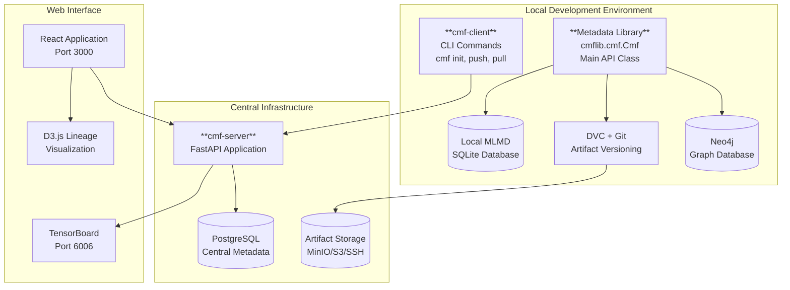
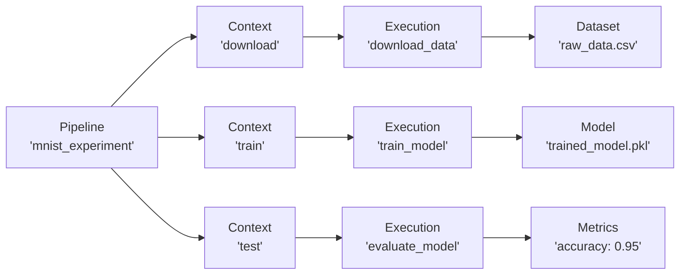
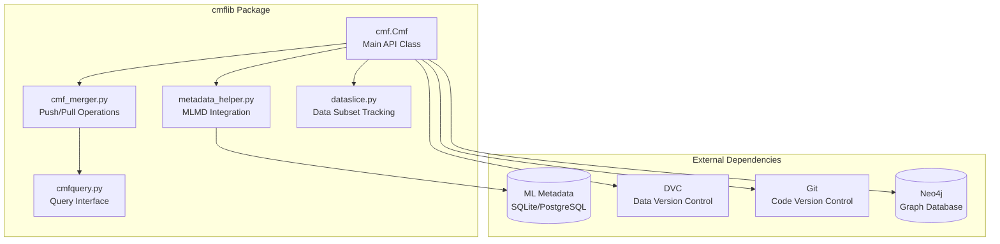
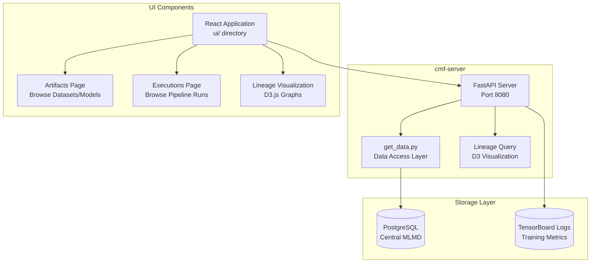

# Getting started with cmf

## Purpose and Scope

This document provides a comprehensive overview of the Common Metadata Framework (CMF), which implements a system for collecting, storing, and querying metadata associated with Machine Learning (ML) pipelines. CMF adopts a data-first approach where all artifacts (datasets, ML models, and performance metrics) are versioned and identified by their content hash, enabling distributed metadata tracking and collaboration across ML teams.

For detailed API documentation, see [Core Library (cmflib)](cmflib/index.md). For server deployment instructions, see [Installation & Setup](setup/index.md). For web user interface details, see [cmf-gui](ui/index.md).

## System Architecture

CMF is designed as a distributed system that enables ML teams to track pipeline metadata locally and synchronize with a central server. The framework automatically tracks code versions, data artifacts, and execution metadata to provide end-to-end traceability of ML experiments.

Common Metadata Framework (CMF) has the following components:

- **Metadata Library** exposes APIs to track pipeline metadata. It also provides APIs to query the stored metadata.
- **cmf-client** interacts with the cmf-server to pull or push metadata.
- **cmf-server with GUI** interacts with remote cmf-clients and merges the metadata transferred by each
  client. This server also provides a GUI that can render the stored metadata.
- **Central Artifact Repositories** host the code and data.

## Core Abstractions

CMF uses three primary abstractions to model ML pipeline metadata:

| Abstraction | Purpose | Implementation |
|-------------|---------|----------------|
| **Pipeline** | Groups related stages and executions | Identified by name in `cmflib.cmf.Cmf` constructor |
| **Context** | Represents a stage type (e.g., "train", "test") | Created via `create_context()` method |
| **Execution** | Represents a specific run of a stage | Created via `create_execution()` method |

## Component Architecture

### CMF Library (`cmflib`)

The `cmflib` package provides the primary API for metadata tracking through the `Cmf` class and supporting modules:

### Server and Web Components

The CMF server provides centralized metadata storage and a web interface for exploring ML pipeline lineage:

## Key Features

### Distributed Metadata Tracking

CMF enables distributed teams to work independently while maintaining consistent metadata through content-addressable artifacts and Git-like synchronization:

- **Local Development**: Each developer works with a local MLMD database
- **Content Hashing**: All artifacts are identified by their content hash for universal identification
- **Synchronization**: `cmf metadata push/pull` commands sync with central server
- **Artifact Storage**: Support for MinIO, Amazon S3, SSH, and local storage backends

### Automatic Version Tracking

CMF automatically captures:

- **Code Version**: Git commit IDs for reproducibility
- **Data Version**: DVC-managed artifact content hashes
- **Environment**: Execution parameters and custom properties
- **Lineage**: Input/output relationships between executions

### Query and Visualization

The system provides multiple interfaces for exploring metadata:

- **Programmatic**: `CmfQuery` class for custom queries
- **Web UI**: React-based interface for browsing artifacts and executions
- **Lineage Graphs**: D3.js visualizations showing data flow between pipeline stages
- **TensorBoard Integration**: Training metrics visualization
