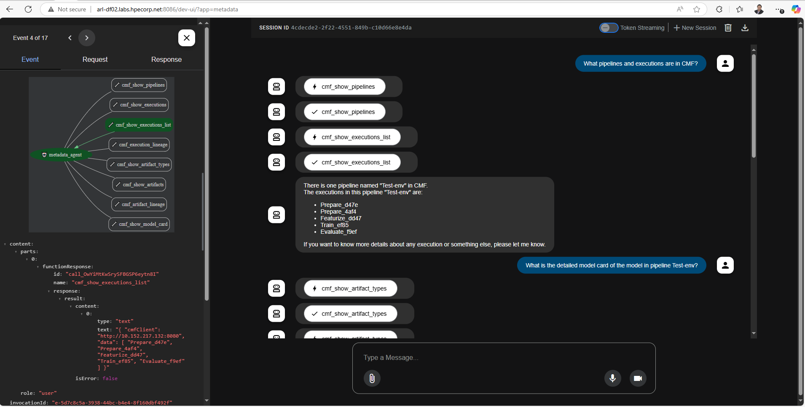
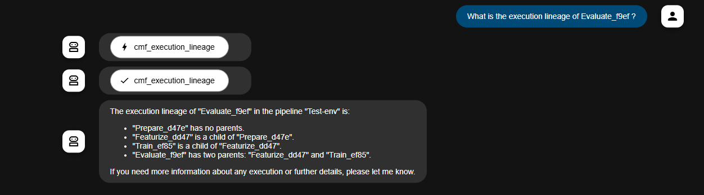
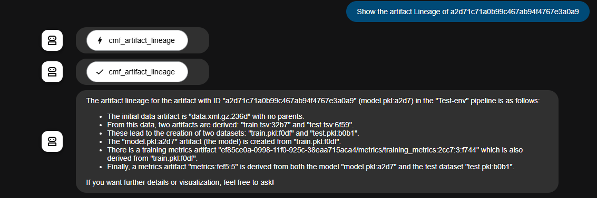
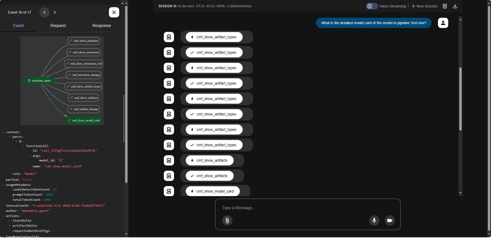

# Examples and Use Cases

This page demonstrates real-world usage of the CMF MCP Server with AI assistants, showing how to explore metadata, analyze lineage, and integrate with various AI platforms.

## Basic Queries

### Discovering Pipelines

**User Query**:
```
What pipelines are available in CMF?
```

**AI Assistant Response**:

The AI assistant will use the `cmf_show_pipelines` tool to retrieve all pipelines:

```json
[
  {
    "cmfClient": "http://server:8080",
    "data": [
      {"name": "Test-env", "id": "1"},
      {"name": "training-pipeline", "id": "2"},
      {"name": "inference-pipeline", "id": "3"}
    ]
  }
]
```

The assistant then provides a human-readable response:

> I found 3 pipelines in your CMF Server:
> 1. Test-env
> 2. training-pipeline
> 3. inference-pipeline

### Exploring Executions

**User Query**:
```
Show me executions in the Test-env pipeline
```

**AI Assistant Action**:

The assistant calls `cmf_show_executions(pipeline="Test-env")` and presents the results:

> The Test-env pipeline has the following executions:
> - **train_model** (UUID: abc123...)
> - **evaluate_model** (UUID: def456...)
> - **data_processing** (UUID: ghi789...)

<div style="text-align: center; margin: 20px 0;">
  
  <p style="color: #666; font-size: 0.9em; margin-top: 8px;">Example: Querying pipelines and executions with an AI assistant</p>
</div>

## Lineage Analysis

### Execution Lineage

Understanding execution relationships is crucial for debugging and reproducibility.

**User Query**:
```
What is the execution lineage for UUID starting with abc1?
```

**AI Assistant Workflow**:

1. Validates the pipeline exists using `cmf_show_pipelines`
2. Retrieves execution lineage using `cmf_execution_lineage(pipeline="Test-env", selected_uuid="abc1")`
3. Presents the lineage tree showing upstream and downstream executions

**Example Response**:

> The execution lineage for abc1 shows:
> - **Parent Execution**: data_preprocessing (ghi789)
> - **Current Execution**: train_model (abc123)
> - **Child Executions**: evaluate_model (def456), deploy_model (jkl012)

<div style="text-align: center; margin: 20px 0;">
  
  <p style="color: #666; font-size: 0.9em; margin-top: 8px;">Example: Execution lineage visualization showing execution dependencies</p>
</div>

### Artifact Lineage

Trace data flow through your pipeline to understand artifact provenance.

**User Query**:
```
Show me the artifact lineage for the Test-env pipeline
```

**AI Assistant Action**:

Calls `cmf_artifact_lineage(pipeline="Test-env")` and visualizes the artifact flow:

> The artifact lineage shows:
> - **Dataset** → data_preprocessing → **Processed_Dataset**
> - **Processed_Dataset** → train_model → **Model**
> - **Model** + **Test_Dataset** → evaluate_model → **Metrics**

<div style="text-align: center; margin: 20px 0;">
  
  <p style="color: #666; font-size: 0.9em; margin-top: 8px;">Example: Artifact lineage graph showing data flow through pipeline stages</p>
</div>

## Model Cards

Retrieve comprehensive model metadata for governance and analysis.

### Basic Model Card Query

**User Query**:
```
What is the Model ID from Test-env?
```

**AI Assistant Workflow**:

1. Uses `cmf_show_artifacts(pipeline="Test-env", artifact_type="Model")`
2. Returns the model ID for further queries

**Response**:
> I found a Model artifact in Test-env with ID: **42**

### Detailed Model Card

**User Query**:
```
What is the detailed model card of the Model in Test-env pipeline?
```

**AI Assistant Workflow**:

1. First retrieves the model ID using `cmf_show_artifacts`
2. Then calls `cmf_show_model_card(model_id="42")`
3. Presents all four sections of the model card

**Example Response Structure**:

> **Model Card for Model ID 42**
>
> **Model Data:**
> - Name: trained_model.pkl
> - Version: 1.0
> - Framework: TensorFlow
> - Size: 25.3 MB
>
> **Model Execution:**
> - Training time: 2025-02-09 10:30:00
> - Parameters: learning_rate=0.001, batch_size=32
> - Training duration: 3.5 hours
>
> **Model Input Artifacts:**
> - training_dataset.csv (Dataset)
> - validation_dataset.csv (Dataset)
>
> **Model Output Artifacts:**
> - training_metrics.json (Metrics)
> - model_checkpoint.pkl (Model)

<div style="text-align: center; margin: 20px 0;">
  
  <p style="color: #666; font-size: 0.9em; margin-top: 8px;">Example: Querying model card information</p>
</div>

<div style="text-align: center; margin: 20px 0;">
  
  <p style="color: #666; font-size: 0.9em; margin-top: 8px;">Example: Model card results showing comprehensive model metadata</p>
</div>

## Multi-Server Queries

Query across development, staging, and production environments simultaneously.

**User Query**:
```
Compare model versions between dev and production CMF servers
```

**AI Assistant Workflow**:

Queries both servers using `cmf_show_artifacts` with `cmfClient_instances` parameter:

```python
cmf_show_artifacts(
    pipeline="training-pipeline",
    artifact_type="Model",
    cmfClient_instances=[
        "http://dev-server:8080",
        "http://prod-server:8080"
    ]
)
```

**Response**:
> **Development Server**: Model v2.1 (trained today)
> **Production Server**: Model v1.8 (deployed last week)
> 
> The development model is 3 versions ahead of production.

## AI Assistant Integration

### Google ADK Integration

The CMF MCP Server integrates seamlessly with Google's Agent Development Kit (ADK) for building custom agents.

**Agent Configuration**:

```python
from google import genai
from google.genai.types import Tool, GenerateContentConfig, GoogleSearch

# Configure MCP Toolset
mcp_tool = Tool(
    google_search=GoogleSearch(
        mcp_servers=[
            {
                "name": "cmf-mcp-server",
                "url": "http://localhost:8000/sse"
            }
        ]
    )
)

# Create agent with CMF tools
agent = genai.Client(
    vertexai=True,
    project=PROJECT_ID,
    location=LOCATION
)

# Configure with CMF MCP tools
config = GenerateContentConfig(
    tools=[mcp_tool],
    system_instruction="You are a metadata assistant. Use CMF tools to help users explore ML pipeline metadata."
)
```

**Example Interaction**:

```python
# User asks about pipelines
response = agent.models.generate_content(
    model="gemini-2.0-flash-exp",
    contents="What pipelines are in CMF?",
    config=config
)
```

The agent automatically:
1. Recognizes it needs CMF data
2. Calls the `cmf_show_pipelines` tool via MCP
3. Formats and presents the results

### Claude Desktop Integration

Configure Claude Desktop to use CMF tools for metadata queries.

**Configuration** (`~/.claude_desktop_config.json`):

```json
{
  "mcpServers": {
    "cmf-mcp": {
      "transport": "streamable-http",
      "url": "http://localhost:8382/mcp"
    }
  }
}
```

**Example Conversation**:

> **User**: What's the lineage for execution abc123 in the Test-env pipeline?
>
> **Claude**: I'll check the execution lineage for you.
> 
> *[Uses cmf_execution_lineage tool]*
> 
> The execution abc123 is part of a training workflow:
> - It receives processed data from the preprocessing step (ghi789)
> - Its outputs feed into the evaluation step (def456)
> - The evaluation results are used by the deployment step (jkl012)

### GitHub Copilot Integration

Enable Copilot to query CMF metadata directly from your IDE.

**Configuration** (`.vscode/mcp.json`):

```json
{
  "servers": {
    "cmf-mcp-server": {
      "type": "http",
      "url": "http://localhost:8382/mcp"
    }
  }
}
```

**Example Usage in VSCode**:

You can ask Copilot directly in your code:

```python
# Ask Copilot: "What artifacts are in the Test-env pipeline?"
# Copilot will use CMF tools to fetch and display the information
```

Copilot can help you:
- Discover available pipelines before writing metadata logging code
- Verify artifact types match your pipeline configuration
- Check execution history while debugging

### Cursor IDE Integration

Cursor provides native MCP support with an intuitive configuration interface.

**Setup Steps**:

1. Open Cursor Settings → Features → MCP Servers
2. Add CMF MCP Server:
   - Name: `cmf-mcp-server`
   - Type: `http`
   - URL: `http://localhost:8382/mcp`

**Example Usage**:

Use Cursor's AI chat to query CMF:

> **User**: @cmf-mcp-server What models exist in the training-pipeline?
>
> **Cursor AI**: *[Queries CMF]* There are 3 Model artifacts in training-pipeline:
> - baseline_model.pkl (ID: 10)
> - improved_model.pkl (ID: 23)
> - production_model.pkl (ID: 42)

## Advanced Use Cases

### Pipeline Comparison

**Query**:
```
Compare execution times between the last 3 runs of the training pipeline
```

**AI Assistant Workflow**:

1. Retrieves executions with `cmf_show_executions`
2. Extracts timing information
3. Calculates and presents comparison

**Response**:
> **Execution Time Comparison**:
> - Run 1 (Feb 7): 2.3 hours
> - Run 2 (Feb 8): 2.1 hours
> - Run 3 (Feb 9): 1.9 hours
>
> Execution time has improved by 17% over the last 3 runs.

### Artifact Provenance

**Query**:
```
Which dataset was used to train the production model?
```

**AI Assistant Workflow**:

1. Finds the production model using `cmf_show_artifacts`
2. Retrieves model card with `cmf_show_model_card`
3. Examines input artifacts section

**Response**:
> The production model (ID: 42) was trained using:
> - **Primary Dataset**: production_training_v2.csv (100K samples)
> - **Validation Dataset**: production_validation_v2.csv (20K samples)
> - **Training Date**: 2025-02-01

### Model Governance Queries

**Query**:
```
List all models trained in the last week with their accuracy metrics
```

**AI Assistant Workflow**:

1. Retrieves all model artifacts
2. Filters by creation date
3. Fetches model cards for each
4. Extracts accuracy metrics

**Response**:
> **Models trained this week**:
> 
> | Model | Training Date | Accuracy |
> |-------|--------------|----------|
> | model_v2.1 | Feb 9 | 0.95 |
> | model_v2.0 | Feb 7 | 0.93 |
> | baseline_v3 | Feb 5 | 0.89 |

## Best Practices

### Efficient Querying

1. **Start broad, then narrow**:
   ```
   What pipelines exist? → What executions are in X? → Show lineage for Y
   ```

2. **Validate before querying**:
   - Check pipeline names with `cmf_show_pipelines` before querying executions
   - Verify artifact types with `cmf_show_artifact_types` before querying artifacts

3. **Use specific servers when possible**:
   - Include `cmfClient_instances` parameter when you know the target server
   - Reduces query time and response size

### Natural Language Tips

AI assistants work best with clear, specific queries:

**Good**:
- ✅ "What is the execution lineage for UUID abc123 in Test-env?"
- ✅ "Show me all Model artifacts in the training-pipeline"
- ✅ "Get the model card for model ID 42"

**Less Effective**:
- ❌ "Tell me about the thing" (too vague)
- ❌ "Show me everything" (too broad)
- ❌ "What happened?" (lacks context)

### Error Recovery

If a query fails, AI assistants can usually recover:

**Example**:
```
User: Show me executions for pipeline XYZ
AI: The pipeline 'XYZ' was not found. Let me check what pipelines are available.
AI: [Uses cmf_show_pipelines]
AI: I found these pipelines: Test-env, training-pipeline, inference-pipeline.
    Did you mean one of these?
```

## Next Steps

- **[Tools Reference](tools.md)** - Detailed documentation for each tool
- **[Configuration](configuration.md)** - Set up multi-server environments
- **[Quick Start](quickstart.md)** - Get started with the MCP Server
