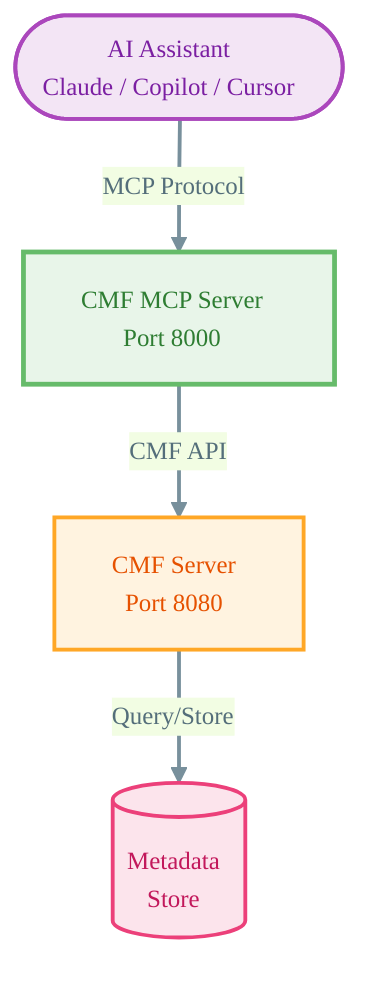

# CMF MCP Server

## Overview

The CMF MCP Server is a [Model Context Protocol](https://modelcontextprotocol.io/) (MCP) server that exposes CMF Server functionality as tools that can be used by AI assistants and language models. This enables LLMs like Claude, GitHub Copilot, and custom AI applications to interact directly with your CMF infrastructure to query pipelines, executions, artifacts, and model metadata.

The MCP Server acts as a bridge between AI assistants and the CMF Server, translating natural language requests into structured CMF API calls and returning results in a format optimized for AI processing.

## What is Model Context Protocol?

[Model Context Protocol (MCP)](https://modelcontextprotocol.io/) is an open standard developed by Anthropic that enables AI applications to securely connect to external data sources and tools. MCP provides a standardized way for LLMs to:

- Access external APIs and services
- Query databases and knowledge bases
- Execute tools and retrieve results
- Maintain context across interactions

By implementing MCP, CMF becomes instantly accessible to any MCP-compatible AI assistant.

## Architecture

The MCP Server is a separate service that communicates with the CMF Server API. It provides a standardized interface that AI assistants can use to explore metadata, analyze lineage, and retrieve model information.



## Features

The CMF MCP Server provides comprehensive access to CMF functionality:

- **Pipeline Exploration**: List and discover all pipelines in your CMF infrastructure
- **Execution Analysis**: Retrieve detailed execution information and lineage trees
- **Artifact Discovery**: Query artifacts by type and analyze artifact relationships
- **Model Cards**: Access complete model metadata including training details and performance
- **Multi-Server Support**: Connect to up to 4 CMF Servers simultaneously for multi-environment queries
- **Production Ready**: Docker containerization, health checks, and automatic dependency management

## Use Cases

### Metadata Discovery

Use natural language to explore your ML pipeline metadata:

- "What pipelines are available in CMF?"
- "Show me all executions for the training pipeline"
- "What datasets were used in the last experiment?"

### Lineage Analysis

Understand relationships between artifacts and executions:

- "What is the execution lineage for UUID abc123?"
- "Show me the artifact lineage for the production pipeline"
- "Which models were trained from this dataset?"

### Model Governance

Retrieve comprehensive model information:

- "Get the model card for model ID 42"
- "What are the input artifacts for this model?"
- "Show model training metrics and parameters"

### Multi-Environment Queries

Query across development, staging, and production environments:

- "Compare model versions between dev and production"
- "Find all artifacts in the staging environment"

## Quick Links

- **[Quick Start](quickstart.md)** - Get the MCP Server running in minutes
- **[Configuration](configuration.md)** - Environment variables and multi-server setup
- **[Tools Reference](tools.md)** - Complete documentation of available tools
- **[Examples](examples.md)** - Real-world usage examples and AI assistant integration

## Supported AI Tools

The CMF MCP Server works with any MCP-compatible AI assistant:

| Tool | Transport | Configuration |
|------|-----------|---------------|
| **GitHub Copilot** | SSE/HTTP | `.vscode/mcp.json` |
| **Claude Desktop** | StreamableHTTP | `~/.claude_desktop_config.json` |
| **Cursor IDE** | HTTP | Settings → MCP Servers |
| **Custom Apps** | HTTP/SSE | Direct API integration |

See [Examples](examples.md) for detailed integration instructions.

## Getting Started

The fastest way to get started is with Docker:

```bash
# Start the full CMF stack with MCP Server
docker-compose -f docker-compose-server.yml up -d

# Verify MCP Server is running
docker-compose -f docker-compose-server.yml ps
```

The MCP Server will be available at `http://localhost:8000`

For detailed installation instructions, see the [Quick Start Guide](quickstart.md).

## Response Format

All MCP tools return consistent, structured responses:

```json
[
  {
    "cmfClient": "http://cmf-server-url",
    "data": [ /* CMF API results */ ]
  }
]
```

This format enables querying multiple CMF Servers and aggregating results for comprehensive analysis.

## Next Steps

- **New Users**: Start with the [Quick Start Guide](quickstart.md)
- **Configuration**: Learn about [environment variables and multi-server setup](configuration.md)
- **Integration**: Explore [AI assistant integration examples](examples.md)
- **Development**: See the [Tools Reference](tools.md) for implementation details
