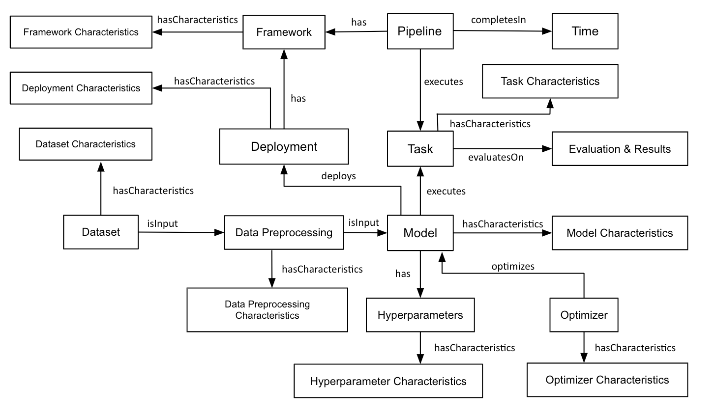

# Metadata schema

The metadata of AI pipelines recorded using Common Metadata Framework (CMF) requires a universal schema 
to record the metadata. Building on top of MLSchema [1], we proposed a pipeline centric schema to log the 
metadata of the AI pipelines. The proposed metadata schema captures the interactions 
and relationships of metadata entities to recommend optimal AI pipeline to user requested task. 
Besides, the proposed schema captures both semantic and statistical properties
of the entities. The overall structure of the schema can be found below.

## Entity Properties
### Task
* Task name
* Task Category
* Task Modality
* Task Children
* Task Parent

### Dataset
* Dataset name
* Dataset Modality
* Dataset URL
* Paper URL
* Number of Class labels
* Total datapoints
* Avg datapoints per labels
* Label types (Eg: food, animals)

### Model
* Model name
* Architecuture (URL)
* Model Class
* Model Modality

### Hyperparameters
* Epoch
* Batch size
* Loss function
* Optimal epoch
* Optimal loss value
* Regularzation techniques
* Normalization techniques

### Optimizer
* Optimizer name
* Learning rate
* Learning rate schedule
* Weight Decay
* LR Decay
* Other parameters (dict)

### Evaluation Metrics and Results
* Eval metric name
* Eval metric value

### Time
* Total execution time
* Data preprocessing time
* Training time
* Inference time

### Framework
* Framework name
* Framework version

### Deployment
* Inference time
* Evaluation metric value
* Model drift (compute and store)

## References
[1] Publio, G. C., Esteves, D., Ławrynowicz, A., Panov, P., Soldatova, L., Soru, T., ... & Zafar, H. (2018). ML-schema:
 exposing the semantics of machine learning with schemas and ontologies. arXiv preprint arXiv:1807.05351.