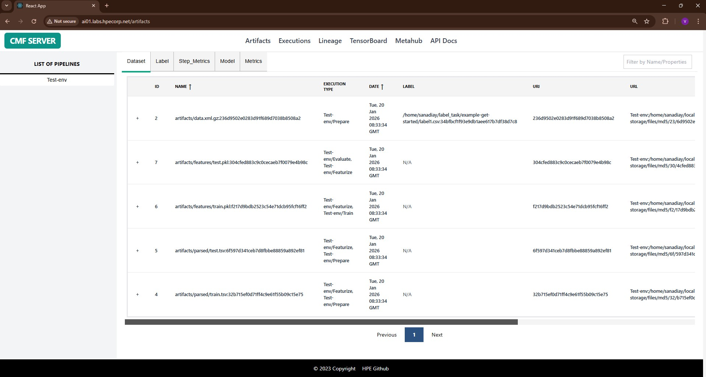

# Artifacts

The Artifacts page provides a comprehensive interface for exploring all types of artifacts (datasets, models, metrics, step metrics) tracked by CMF across your ML pipelines. This page enables users to search, filter, and analyze artifacts with detailed metadata and version history.

Artifacts represent the data entities in your ML pipeline:

- **Datasets**: Training data, test data, validation sets, feature matrices
- **Models**: Trained ML models, model checkpoints, exported models
- **Metrics**: Performance metrics, evaluation results, quality measures

---

## Page Features

### 1. Filter Panel

The filter panel allows you to narrow down artifacts based on multiple criteria:

| Filter Type | Description | Options |
|-------------|-------------|----------|
| **Artifact Type** | Filter by artifact category | Dataset, Model, Metrics |
| **Custom Properties** | Filter by user-defined metadata | Based on tracked properties |

**Usage:**

1. Select a pipeline from the dropdown to view its artifacts
2. Choose artifact type (Dataset/Model/Metrics) from tabs
3. Use search box for full-text search across artifact names and properties

### 2. Artifacts Table

The main table displays artifacts with the following columns:

| Column | Description |
|--------|-------------|
| Name | Artifact name and identifier |
| Type | Artifact type (Dataset/Model/Metrics) |
| URI | Artifact location/path |
| Pipeline | Associated pipeline name |
| Created At | Timestamp of creation |
| Custom Properties | User-defined metadata |

**Interactions:**

- **Click on artifact name**: Opens detailed view with full metadata
- **Click column headers**: Sort by that column (ascending/descending)
- **Pagination controls**: Navigate through large artifact lists

## Using the Artifacts Page

### Example 1: Find All Models from a Pipeline

1. Navigate to **Artifacts** page from the sidebar
2. Select your pipeline from the **Pipeline** dropdown
3. Click on the **Model** tab to filter by model artifacts
4. Review the list of all models created by that pipeline
5. Click on a model name to view training parameters and metrics

### Example 2: Track Metrics Over Time

1. Select **Metrics** artifact type tab
2. Sort by **Created** column to view chronologically
3. Click on metrics artifacts to view values
4. Compare metrics across different model versions

---

## Related Pages

- [Executions Page](executions.md) - View pipeline runs that created these artifacts
- [Lineage Page](lineage.md) - Visualize artifact dependencies and data flow
- [CMF Client Commands](../cmf_client/cmf_client_commands.md) - CLI for artifact management
- [Installation & Setup](../setup/index.md) - Set up CMF Server and GUI