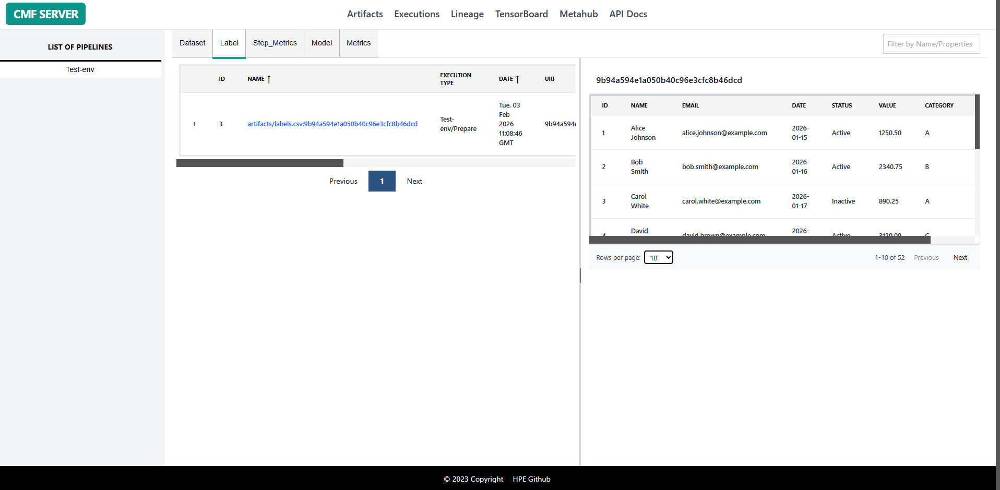

# Artifacts

The Artifacts page provides a comprehensive interface for exploring all types of artifacts (datasets, models, metrics, step metrics, labels) tracked by CMF across your ML pipelines. This page enables users to search, filter, and analyze artifacts with detailed metadata and version history.

Artifacts represent the data entities in your ML pipeline:

- **Datasets**: Training data, test data, validation sets, feature matrices. Tracked with version control and DVC metadata.
- **Models**: Trained ML models, model checkpoints, exported models with versioning information.
- **Metrics**: Execution-level metrics (coarse-grained tracking) without backing physical files. Used to log metadata associated with the entire execution.
- **Step_Metrics**: Fine-grained metrics stored in Parquet files. Captures per-step or per-epoch metrics during training/execution, committed to version control.
- **Labels**: Data labels and annotations, usually CSV files containing information about datasets. Connected to datasets via "has_label" relationship.

## Page Features

### 1. Filter Panel

The filter panel allows you to narrow down artifacts based on multiple criteria:

| Filter Type | Description | Options |
|-------------|-------------|----------|
| **Artifact Type** | Filter by artifact category | Dataset, Label, Step_Metrics, Model, Metrics |
| **Search Filter** | Search across all artifact properties | Enter any text to search execution names, stages, Git commits, or any execution metadata. Matching executions will be displayed in the table. |

**Usage:**

1. Select a pipeline from the sidebar to view its artifacts
2. Choose artifact type (Dataset/Label/Step_Metrics/Model/Metrics) from tabs
3. Use filter box to search by artifact name or properties

### 2. Artifacts Table

The main table displays artifacts with the following columns:

| Column | Description |
|--------|-------------|
| **+** | Expandable icon to view detailed artifact information |
| **ID** | Unique artifact identifier |
| **Name** | Artifact name and identifier |
| **Execution Type** | Execution name where artifact was created |
| **Date** | Timestamp of creation |
| **URI** | Artifact location/path |
| **URL** | Associated URL reference |
| **Git Repo** | GitHub Repository URL |
| **Commit** | Git commit hash |

**Interactions:**

- **Click + icon**: Expands row to show detailed artifact metadata, custom properties, and version information
- **Click column headers**: Sort by NAME or DATE column (ascending/descending)
- **Pagination controls**: Navigate through large artifact lists using Previous/Next buttons and page numbers

## Using the Artifacts Page

### Example 1: Find All Datasets from a Pipeline

1. Navigate to **Artifacts** page by clicking on the header tab
2. Select a pipeline from the **LIST OF PIPELINES** sidebar
3. The **Dataset** tab is selected by default
4. Review the list of all datasets used in that pipeline
5. Click the **+** icon to view detailed artifact metadata

### Example 2: View Models and Their Execution Context

1. Select a pipeline from the sidebar
2. Click on the **Model** tab to filter by model artifacts
3. Review the **EXECUTION TYPE** column to see which pipeline stage created each model
4. Click the **+** icon to view training parameters, version information, and metrics

### Example 3: Track Metrics Over Time

1. Select the **Metrics** or **Step_Metrics** artifact type tab
2. Click the **DATE** column header to sort chronologically
3. Click the **+** icon on any metric to view its values
4. Compare metrics across different execution runs

### Example 4: Find Artifacts with Labels

1. Navigate to any artifact type tab (typically Dataset)
2. Check the **LABEL** column to identify artifacts with associated labels
3. Click the **Label** tab to view all label artifacts
4. Use the filter box to search for specific label files

## Additional Snapshots

#### 1. Model Card

#### 2. Label Content
 

## Related Pages

- [Executions Page](executions.md) - View pipeline runs that created these artifacts
- [Lineage Page](lineage.md) - Visualize artifact dependencies and data flow
- [CMF Client Commands](../cmf_client/cmf_client_commands.md) - CLI for artifact management
- [Installation & Setup](../setup/index.md) - Set up CMF Server and GUI