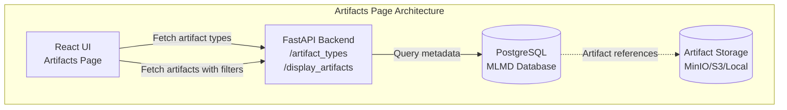

# Artifacts Page

The Artifacts page provides a comprehensive interface for exploring all datasets, models, and metrics tracked by CMF across your ML pipelines. This page enables users to search, filter, and analyze artifacts with detailed metadata and version history.

## Overview

Artifacts represent the data entities in your ML pipeline:
- **Datasets**: Training data, test data, validation sets, feature matrices
- **Models**: Trained ML models, model checkpoints, exported models
- **Metrics**: Performance metrics, evaluation results, quality measures



---

## Page Features

### 1. Filter Panel

The filter panel allows you to narrow down artifacts based on multiple criteria:

| Filter Type | Description | Options |
|-------------|-------------|----------|
| **Pipeline Name** | Filter by specific pipeline | Dropdown of all available pipelines |
| **Artifact Type** | Filter by artifact category | Dataset, Model, Metrics |
| **Custom Properties** | Filter by user-defined metadata | Based on tracked properties |
| **Time Range** | Filter by creation date | Date range picker |

**Usage:**
1. Select a pipeline from the dropdown to view its artifacts
2. Choose artifact type (Dataset/Model/Metrics) from tabs
3. Use search box for full-text search across artifact names and properties

### 2. Artifacts Table

The main table displays artifacts with the following columns:

| Column | Description | Sortable |
|--------|-------------|----------|
| **Name** | Artifact name and identifier | ✓ |
| **Type** | Artifact type (Dataset/Model/Metrics) | ✓ |
| **URI** | Artifact location/path | ✗ |
| **Pipeline** | Associated pipeline name | ✓ |
| **Stage** | Pipeline stage that created it | ✓ |
| **Created** | Timestamp of creation | ✓ |
| **Custom Properties** | User-defined metadata | ✗ |

**Interactions:**
- **Click on artifact name**: Opens detailed view with full metadata
- **Click column headers**: Sort by that column (ascending/descending)
- **Pagination controls**: Navigate through large artifact lists

### 3. Artifact Details View

Clicking on an artifact name opens a detailed panel showing:

#### Basic Information
- **Artifact ID**: Unique identifier in MLMD
- **Name**: Human-readable artifact name
- **Type**: Dataset, Model, or Metrics
- **URI**: Full path to artifact location
- **Content Hash**: SHA256 hash for version identification
- **Created Time**: Timestamp of artifact creation
- **Last Updated**: Timestamp of last modification

#### Pipeline Context
- **Pipeline Name**: Parent pipeline
- **Stage/Context**: Pipeline stage that produced this artifact
- **Execution ID**: Specific execution that created it
- **Git Commit**: Code version at creation time

#### Custom Properties

User-defined metadata tracked via CMF API:
```python
# Example: Properties visible in GUI
artifact.custom_properties = {
    "framework": "tensorflow",
    "version": "2.10.0",
    "accuracy": "0.95",
    "dataset_size": "10000",
    "tags": "production,v1.2"
}
```

#### Version History

For artifacts with multiple versions:
- List of all versions with timestamps
- Content hash for each version
- Associated executions for each version
- Diff view showing property changes between versions

---

## Using the Artifacts Page

### Example 1: Find All Models from a Pipeline

1. Navigate to **Artifacts** page from the sidebar
2. Select your pipeline from the **Pipeline** dropdown
3. Click on the **Model** tab to filter by model artifacts
4. Review the list of all models created by that pipeline
5. Click on a model name to view training parameters and metrics

### Example 2: Compare Dataset Versions

1. Search for your dataset name in the search box
2. Click on the dataset to open details
3. Scroll to **Version History** section
4. Compare content hashes and properties across versions
5. Identify which executions used which version

### Example 3: Track Metrics Over Time

1. Select **Metrics** artifact type tab
2. Sort by **Created** column to view chronologically
3. Click on metrics artifacts to view values
4. Compare metrics across different model versions

---

## API Integration

### Backend Endpoints Used

The Artifacts page interacts with these CMF Server endpoints:

```python
# Get list of pipelines
GET /display_pipelines

# Get artifact types for a pipeline
GET /artifact_types?pipeline_name={pipeline}

# Get artifacts with filtering
GET /display_artifacts?pipeline_name={pipeline}&type={type}

# Get artifact lineage
GET /artifact-lineage/force-directed-graph/{pipeline}
```

### Query Example

Using `CmfQuery` to retrieve artifact data programmatically:

```python
from cmflib.cmfquery import CmfQuery

# Initialize query object
query = CmfQuery(mlmd_path="/path/to/mlmd")

# Get all artifacts by type
datasets = query.get_all_artifacts_by_type("Dataset")
models = query.get_all_artifacts_by_type("Model")
metrics = query.get_all_artifacts_by_type("Metrics")

# Get artifacts for specific pipeline
pipeline_id = query.get_pipeline_id("my-pipeline")
artifacts = query.get_all_artifacts_for_pipeline(pipeline_id)

# Get artifact by name
artifact = query.get_artifact("trained_model.pkl")
print(f"Artifact ID: {artifact['id']}")
print(f"URI: {artifact['uri']}")
print(f"Custom Properties: {artifact['custom_properties']}")
```

---

## Advanced Features

### Search Functionality

The search box supports:
- **Full-text search**: Searches across artifact names, URIs, and properties
- **Wildcards**: Use `*` for pattern matching (e.g., `model_*_final`)
- **Property search**: Search by custom property values

### Pagination

For large artifact collections:
- **Items per page**: Configurable (default: 50)
- **Page navigation**: First, Previous, Next, Last buttons
- **Jump to page**: Direct page number input
- **Total count**: Displays total number of matching artifacts

### Export Functionality

Export artifact metadata:
- **CSV Export**: Download table as CSV file
- **JSON Export**: Download as structured JSON
- **Filtered Export**: Only exports currently filtered artifacts

---

## Tips and Best Practices

1. **Use Descriptive Names**: Name artifacts clearly (e.g., `train_dataset_v1.2` instead of `data.csv`)
2. **Add Custom Properties**: Track important metadata like accuracy, dataset size, framework version
3. **Tag Artifacts**: Use tags in properties for easy filtering (e.g., `tags: production,validated`)
4. **Regular Cleanup**: Archive or remove outdated artifacts to keep lists manageable
5. **Version Naming**: Use consistent version naming schemes (e.g., `v1.0`, `v1.1`, `v2.0`)

---

## Troubleshooting

### Artifacts Not Appearing

**Issue**: Expected artifacts don't show in the list

**Solutions**:
1. Check pipeline selection - ensure correct pipeline is selected
2. Verify artifact type filter - check if filtering by wrong type
3. Check if metadata was pushed: `cmf metadata push -p pipeline-name`
4. Refresh the page to reload data from server

### Slow Loading

**Issue**: Artifacts page takes long to load

**Solutions**:
1. Use filters to reduce dataset size
2. Increase pagination size to reduce number of requests
3. Check CMF Server logs for performance issues
4. Consider archiving old artifacts to a separate database

### Missing Properties

**Issue**: Custom properties not visible

**Solutions**:
1. Verify properties were logged during artifact creation:
   ```python
   cmf.log_dataset("data.csv", "input", 
                   custom_properties={"size": "1000"})
   ```
2. Check if properties were pushed to server
3. Ensure property keys don't contain special characters

---

## Related Pages

- [Executions Page](executions.md) - View pipeline runs that created these artifacts
- [Lineage Page](lineage.md) - Visualize artifact dependencies and data flow
- [CMF Client Commands](../cmf_client/cmf_client_commands.md) - CLI for artifact management
- [Installation & Setup](../setup/index.md) - Set up CMF Server and GUI