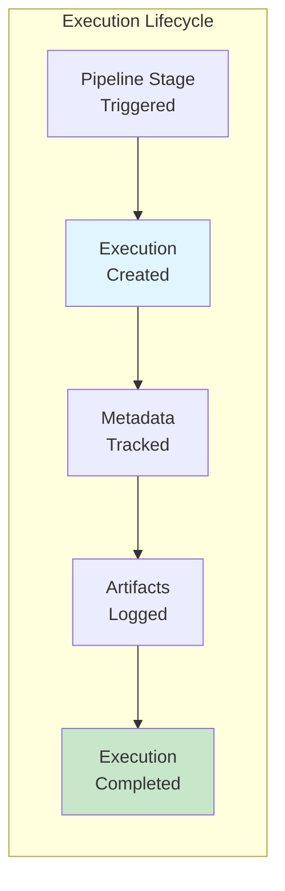
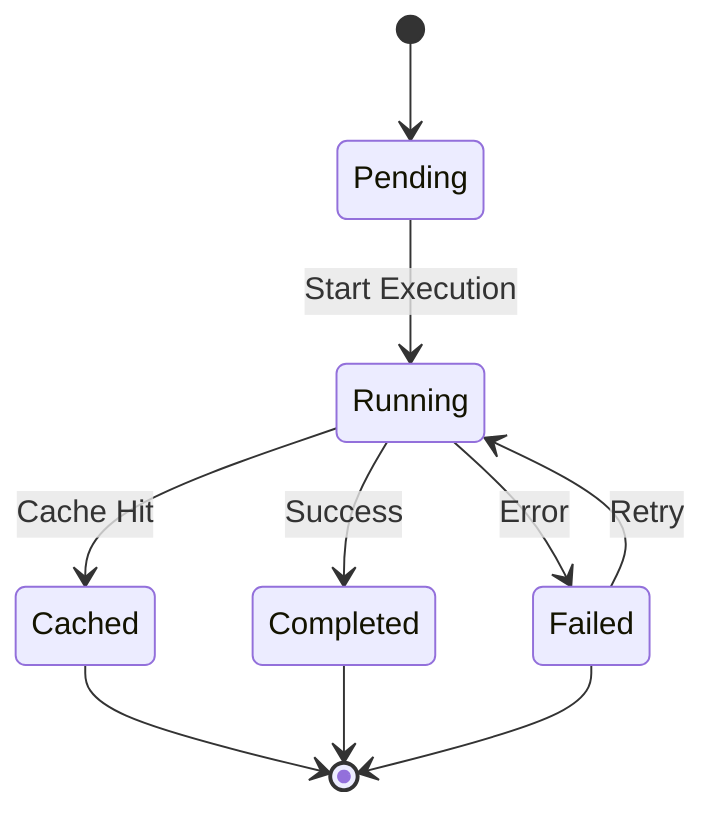

# Executions Page

The Executions page provides detailed insights into pipeline runs, showing when stages executed, what parameters were used, and what artifacts were produced. This page is essential for debugging pipeline issues, comparing runs, and understanding execution history.

## Overview

An **Execution** represents a single run of a pipeline stage. Each execution captures:
- **Configuration**: Parameters and environment settings
- **Code Version**: Git commit that was executed
- **Artifacts**: Input and output artifacts
- **Metadata**: Runtime information and custom properties
- **Lineage**: Relationships to other executions and artifacts



---

## Page Features

### 1. Execution Filters

Filter executions to find specific runs:

| Filter | Description | Usage |
|--------|-------------|-------|
| **Pipeline Name** | Select specific pipeline | Dropdown with all pipelines |
| **Execution Type** | Filter by stage name | e.g., "train", "test", "prepare" |
| **Date Range** | Filter by execution time | Date picker for start/end dates |
| **Status** | Filter by completion status | Running, Completed, Failed |
| **Git Branch** | Filter by code branch | Dropdown of tracked branches |

### 2. Executions Table

The main table displays execution runs with these columns:

| Column | Description | Information |
|--------|-------------|-------------|
| **Execution ID** | Unique identifier | Numeric ID from MLMD |
| **Name** | Execution name | Stage name + unique suffix |
| **Pipeline** | Parent pipeline | Pipeline name |
| **Context/Stage** | Pipeline stage | e.g., "train", "evaluate" |
| **Status** | Execution state | Running/Completed/Failed |
| **Started** | Start timestamp | When execution began |
| **Duration** | Execution time | Time taken to complete |
| **Git Commit** | Code version | Short commit hash |
| **Actions** | Quick actions | View details, View lineage |

**Table Interactions:**
- **Click execution name**: Opens detailed execution view
- **Sort columns**: Click headers to sort by that field
- **Multi-select**: Select multiple executions for comparison
- **Pagination**: Navigate through execution history

### 3. Execution Details View

Clicking on an execution opens a comprehensive details panel:

#### Metadata Section

```yaml
Execution Information:
  ID: 42
  Name: train_model_a3f9
  Type: Train
  Pipeline: mnist-classifier
  Context: training-stage
  Status: Completed
  
Timing:
  Created: 2026-01-21 14:23:10 UTC
  Started: 2026-01-21 14:23:15 UTC
  Completed: 2026-01-21 14:28:43 UTC
  Duration: 5m 28s
```

#### Git Information

```yaml
Code Version:
  Commit Hash: a3f9e2b7
  Branch: feature/improved-model
  Repository: https://github.com/user/ml-project
  Author: john.doe@example.com
  Commit Message: "Improved model architecture"
```

#### Execution Properties

Custom properties logged during execution:

```python
# Properties visible in GUI
Execution Properties:
  learning_rate: 0.001
  batch_size: 32
  epochs: 50
  optimizer: adam
  python_version: 3.10.0
  cuda_version: 11.7
  gpu_used: Tesla V100
```

#### Input Artifacts

List of artifacts consumed by this execution:

| Artifact Name | Type | Version | URI |
|---------------|------|---------|-----|
| train_dataset.csv | Dataset | v1.2 | s3://bucket/data/train.csv |
| val_dataset.csv | Dataset | v1.2 | s3://bucket/data/val.csv |
| config.json | Metrics | v1.0 | /local/config.json |

#### Output Artifacts

List of artifacts produced by this execution:

| Artifact Name | Type | Version | URI |
|---------------|------|---------|-----|
| trained_model.pkl | Model | v2.3 | s3://bucket/models/model.pkl |
| training_metrics.json | Metrics | v2.3 | s3://bucket/metrics.json |
| model_checkpoint.h5 | Model | v2.3 | s3://bucket/checkpoints/ckpt.h5 |

#### Events Timeline

Chronological list of events during execution:

```mermaid
gantt
    title Execution Timeline
    dateFormat HH:mm:ss
    section Data Loading
    Load training data    :14:23:15, 30s
    Load validation data  :14:23:45, 15s
    section Training
    Initialize model      :14:24:00, 10s
    Training epochs       :14:24:10, 4m
    section Evaluation
    Validate model        :14:28:10, 20s
    Save artifacts        :14:28:30, 13s
```



---

## Using the Executions Page

### Example 1: Debug a Failed Execution

1. Navigate to **Executions** page
2. Filter by **Status**: "Failed"
3. Select the most recent failed execution
4. Review **Execution Properties** for parameter issues
5. Check **Input Artifacts** to verify data availability
6. Examine **Git Commit** to identify code changes
7. Compare with previous successful execution

### Example 2: Compare Training Runs

1. Select pipeline from dropdown
2. Filter by **Execution Type**: "train"
3. Select multiple training executions (use checkboxes)
4. Click **Compare** button
5. View side-by-side comparison of:
   - Hyperparameters
   - Training metrics
   - Output models
   - Execution duration

### Example 3: Track Experiment History

1. Select your experiment pipeline
2. Sort by **Started** column (descending) for latest first
3. Review each execution's properties to see parameter variations
4. Click on execution to view detailed metrics
5. Use **View Lineage** action to see data flow

---

## Execution States

### Status Indicators

| Status | Icon | Meaning | Actions Available |
|--------|------|---------|-------------------|
| **Running** | 🔄 | Execution in progress | View logs, Monitor |
| **Completed** | ✅ | Successfully finished | View results, Compare |
| **Failed** | ❌ | Execution failed | Debug, Retry, View logs |
| **Cached** | 💾 | Reused from cache | View original, Use results |
| **Pending** | ⏳ | Waiting to start | Cancel, View queue |

### Status Transitions



---

## Advanced Features

### Execution Comparison

Compare multiple executions side-by-side:

1. **Select executions**: Check boxes next to 2-5 executions
2. **Click Compare**: Button appears when multiple selected
3. **View differences**:
   - Parameter differences highlighted
   - Metric deltas calculated
   - Performance comparison charts
   - Artifact version differences

### Execution Search

Advanced search capabilities:

```python
# Search by property
property:learning_rate=0.001

# Search by date range
date:2026-01-01 TO 2026-01-31

# Search by git commit
commit:a3f9e2b7

# Combined search
pipeline:mnist AND status:completed AND property:epochs>10
```

### Export Execution Data

Export options:
- **CSV Export**: Table data with properties
- **JSON Export**: Complete execution metadata
- **Report Generation**: PDF report with charts
- **Batch Export**: Export multiple executions at once

---

## API Integration

### Backend Endpoints

Executions page uses these CMF Server endpoints:

```python
# Get all executions for a pipeline
GET /execution_types?pipeline_name={pipeline}

# Get execution details
GET /display_executions?pipeline_name={pipeline}&type={type}

# Get execution lineage
GET /execution-lineage/force-directed-graph/{pipeline}/{uuid}
```

### Programmatic Access

Query executions using CmfQuery:

```python
from cmflib.cmfquery import CmfQuery

# Initialize query
query = CmfQuery(mlmd_path="/path/to/mlmd")

# Get all executions for a pipeline
pipeline_id = query.get_pipeline_id("my-pipeline")
executions = query.get_all_executions_in_pipeline(pipeline_id)

# Get executions by stage
stage_id = query.get_pipeline_stage("my-pipeline", "train")
train_executions = query.get_all_executions_in_stage(stage_id)

# Get execution by ID
execution = query.get_execution_by_id(42)
print(f"Execution: {execution['name']}")
print(f"Status: {execution['status']}")
print(f"Properties: {execution['custom_properties']}")

# Get artifacts for execution
input_artifacts = query.get_all_artifacts_for_execution(42, "INPUT")
output_artifacts = query.get_all_artifacts_for_execution(42, "OUTPUT")
```

---

## Performance Monitoring

### Execution Metrics Dashboard

The executions page can display aggregate metrics:

| Metric | Description | Usage |
|--------|-------------|-------|
| **Success Rate** | % of successful executions | Track pipeline reliability |
| **Avg Duration** | Average execution time | Identify performance trends |
| **Failure Rate** | % of failed executions | Monitor pipeline health |
| **Throughput** | Executions per day/hour | Capacity planning |

### Alerts and Notifications

Set up alerts for:
- **Long Running Executions**: Alert if exceeds expected duration
- **Failed Executions**: Immediate notification on failures
- **Property Thresholds**: Alert when metrics exceed limits
- **Resource Usage**: Warning on high memory/CPU usage

---

## Tips and Best Practices

1. **Use Descriptive Names**: Name executions clearly (e.g., `train_model_experiment_v3`)
2. **Log Parameters**: Always log hyperparameters and configuration
3. **Track Git Commits**: Ensure git commit is captured for reproducibility
4. **Add Custom Properties**: Log environment details (GPU type, Python version)
5. **Regular Cleanup**: Archive old executions to maintain performance
6. **Document Failures**: Add notes to failed executions explaining issues
7. **Tag Important Runs**: Use properties to tag production or baseline runs

---

## Troubleshooting

### Executions Not Appearing

**Issue**: Expected executions don't show up

**Solutions**:
1. Verify pipeline name is correct
2. Check if metadata was pushed: `cmf metadata push -p pipeline-name`
3. Refresh the page
4. Check execution type filter
5. Verify date range filter isn't excluding executions

### Missing Execution Details

**Issue**: Execution details are incomplete

**Solutions**:
1. Ensure `cmf.create_execution()` was called
2. Verify properties were logged:
   ```python
   execution.log_execution_metrics_from_dict({
       "learning_rate": 0.001,
       "batch_size": 32
   })
   ```
3. Check if artifacts were properly logged
4. Ensure execution was finalized before querying

### Performance Issues

**Issue**: Page loads slowly with many executions

**Solutions**:
1. Use filters to reduce dataset
2. Increase pagination size
3. Archive old executions
4. Enable database indexing on frequently queried fields
5. Consider database optimization

---

## Related Pages

- [Artifacts Page](artifacts.md) - View artifacts produced by executions
- [Lineage Page](lineage.md) - Visualize execution flow and dependencies
- [CMF Client Commands](../cmf_client/cmf_client_commands.md) - CLI for execution management
- [CMFLib API](../cmflib/index.md) - Programmatic execution tracking