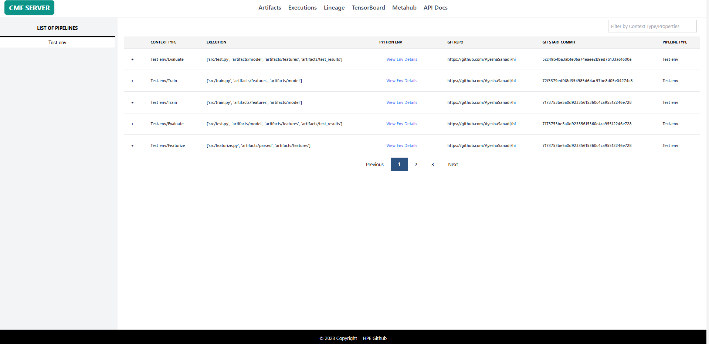

# Executions

The Executions page provides detailed insights into pipeline runs, showing when stages executed, what parameters were used, and what artifacts were produced. This page is essential for debugging pipeline issues, comparing runs, and understanding execution history.

An **Execution** represents a single run of a pipeline stage. Each execution captures:

- **Configuration**: Parameters and environment settings
- **Code Version**: Git commit that was executed
- **Artifacts**: Input and output artifacts
- **Metadata**: Runtime information and custom properties

---

## Page Features

### 1. Execution Filters

Filter executions to find specific runs:

| Filter | Description | Usage |
|--------|-------------|-------|
| **Pipeline Name** | Select specific pipeline | Dropdown with all pipelines |
| **Execution Type** | Filter by stage name | e.g., "train", "test", "prepare" |
| **Git Branch** | Filter by code branch | Dropdown of tracked branches |

### 2. Executions Table

The main table displays execution runs with these columns:

| Column | Description | Information |
|--------|-------------|-------------|
| **Execution ID** | Unique identifier | Numeric ID from MLMD |
| **Name** | Execution name | Stage name + unique suffix |
| **Pipeline** | Parent pipeline | Pipeline name |
| **Context/Stage** | Pipeline stage | e.g., "train", "evaluate" |
| **Original Epoch Time** | Start timestamp | When execution began |
| **Duration** | Execution time | Time taken to complete |
| **Git Commit** | Code version | Short commit hash |

**Table Interactions:**

- **Click execution name**: Opens detailed execution view
- **Sort columns**: Click headers to sort by that field

## Related Pages

- [Artifacts Page](artifacts.md) - View artifacts produced by executions
- [Lineage Page](lineage.md) - Visualize execution flow and dependencies
- [CMF Client Commands](../cmf_client/cmf_client_commands.md) - CLI for execution management
- [cmflib API](../cmflib/index.md) - Programmatic execution tracking