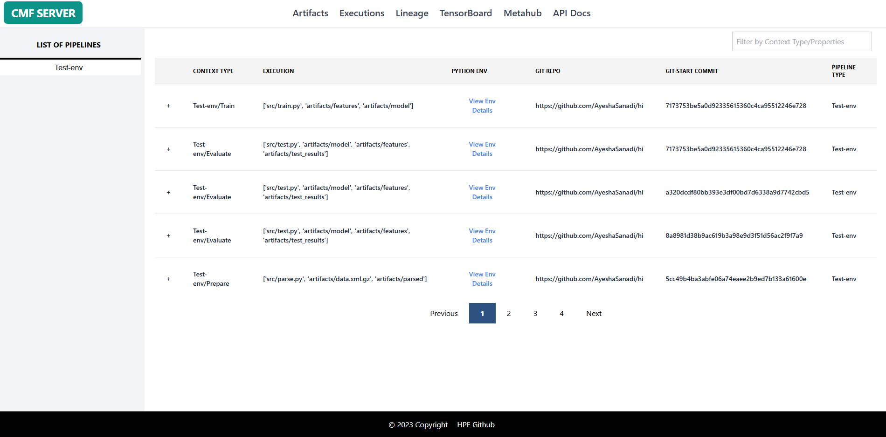
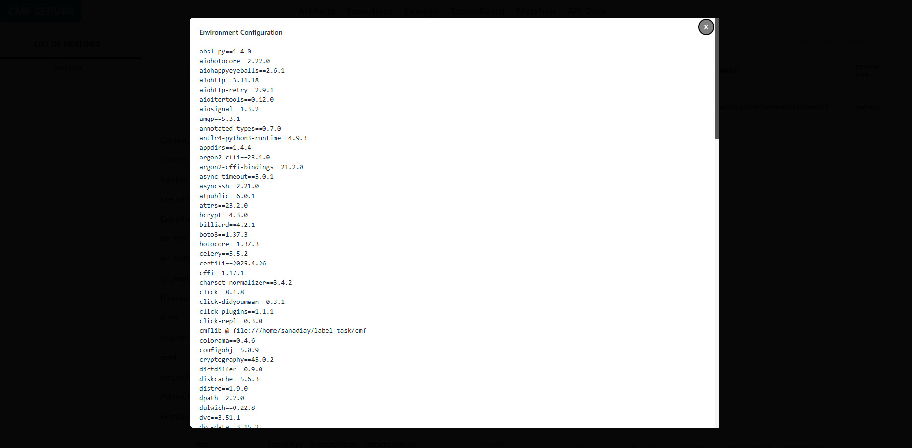

# Executions

The Executions page provides detailed insights into pipeline runs, showing when stages executed, what parameters were used, and what artifacts were produced. This page is essential for debugging pipeline issues, comparing runs, and understanding execution history.

An **Execution** represents a single run of a pipeline stage. Each execution captures:

- **Configuration**: Parameters and environment settings
- **Code Version**: Git commit that was executed
- **Artifacts**: Input and output artifacts used in the execution
- **Metadata**: Runtime information and custom properties

## Page Features

### 1. Filter Box

Search and filter executions based on context type or properties:

| Filter | Description |
|--------|-------------|
| **Filter by Context Type/Properties** | Enter any text to search across execution context types (pipeline stages), execution artifacts, Git commits, or any execution metadata. Matching executions will be displayed in the table. |

### 2. Executions Table

The main table displays execution runs with the following columns:

| Column | Description |
|--------|-------------|
| **+** | Expandable icon to view detailed execution information |
| **Context Type** | Pipeline stage name in format `Pipeline/Stage` (e.g., "Test-env/Train", "Test-env/Evaluate") |
| **Execution** | Array of execution artifacts including scripts, input datasets, and output artifacts (e.g., ['src/train.py', 'artifacts/features', 'artifacts/model']) |
| **Python Env** | View Python environment details used during execution |
| **Git Repo** | GitHub repository URL where the code is hosted |
| **Git Start Commit** | Full Git commit hash identifying the exact code version that was executed |
| **Pipeline Type** | Name of the parent pipeline (e.g., "Test-env") |

**Table Interactions:**

- **Click + icon**: Expands row to show detailed execution metadata, custom properties, and additional information
- **View Env Details**: Opens Python environment details showing packages and versions used
- **Pagination controls**: Navigate through execution history using Previous/Next buttons and page numbers

## Using the Executions Page

### Example 1: Find Executions from a Specific Pipeline Stage

1. Select a pipeline from the **LIST OF PIPELINES** sidebar
2. Use the filter box to search for a stage name (e.g., "Train" or "Evaluate")
3. Review the filtered executions in the table
4. Click the **+** icon to view detailed execution information

### Example 2: Compare Git Commits Across Executions

1. Navigate to the **Executions** page
2. Locate the **Git Start Commit** column
3. Compare commit hashes across different execution runs
4. Click the **Git Repo** link to view the code on GitHub

### Example 3: Inspect Python Environment

1. Find the execution you want to inspect
2. Click **View Env Details** in the **Python Env** column
3. Review the packages and versions used in that execution

## Additional Snapshots

#### 1. Python Env Popup Card

## Related Pages

- [Artifacts Page](artifacts.md) - View artifacts produced by executions
- [Lineage Page](lineage.md) - Visualize execution flow and dependencies
- [CMF Client Commands](../cmf_client/cmf_client_commands.md) - CLI for execution management
- [cmflib API](../cmflib/index.md) - Programmatic execution tracking