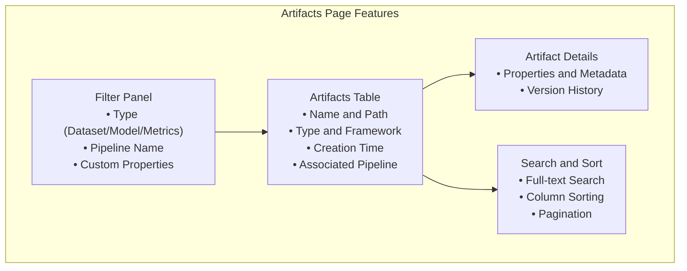
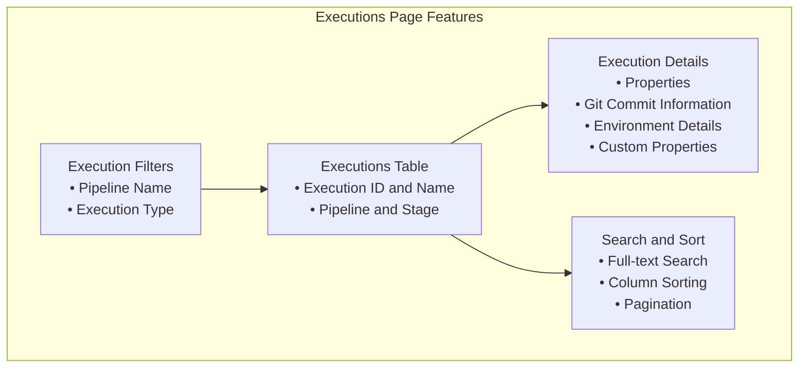

# Getting Started with cmf-gui

The cmf-gui provides an intuitive, browser-based interface for exploring ML pipeline metadata, visualizing lineage relationships, and monitoring experiment progress. Built with React and D3.js, it offers interactive dashboards for artifacts, executions, and pipeline lineage.

## Artifacts and Executions Pages

The web interface provides dedicated pages for browsing and analyzing pipeline artifacts and executions.

### Artifacts Page

The Artifacts page allows users to explore all datasets, models, and metrics tracked by CMF:

#### Key Features

| Feature | Description | Usage |
|---------|-------------|-------|
| **Type Filtering** | Filter by artifact type | Select Dataset, Model, or Metrics |
| **Pipeline Filtering** | Filter by pipeline name | Choose from available pipelines |
| **Search** | Full-text search across metadata | Search names, properties, descriptions |
| **Sorting** | Sort by any column | Click column headers to sort |
| **Details View** | Detailed artifact information | Click artifact name for details |

#### Artifact Details

Each artifact provides comprehensive information:

- **Basic Information**: Name, type, creation time
- **Pipeline Context**: Associated pipeline, stage, and execution
- **Custom Properties**: User-defined metadata and labels
- **Version History**: All versions of the artifact with diffs

### Executions Page

The Executions page provides insights into pipeline runs and their performance:

#### Execution Information

Each execution entry displays:

- **Execution Metadata**: ID, name, type
- **Pipeline Context**: Pipeline name, stage, context information
- **Git Information**: Commit hash, branch, repository URL
- **Parameters**: Execution parameters and configuration

