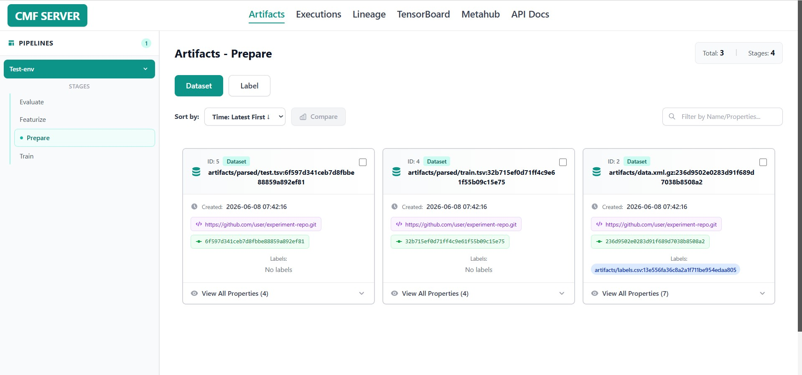
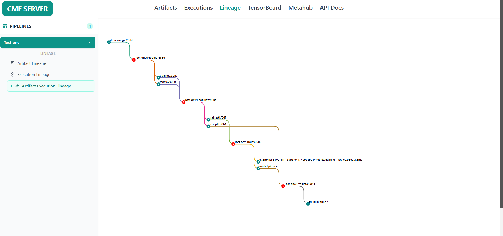
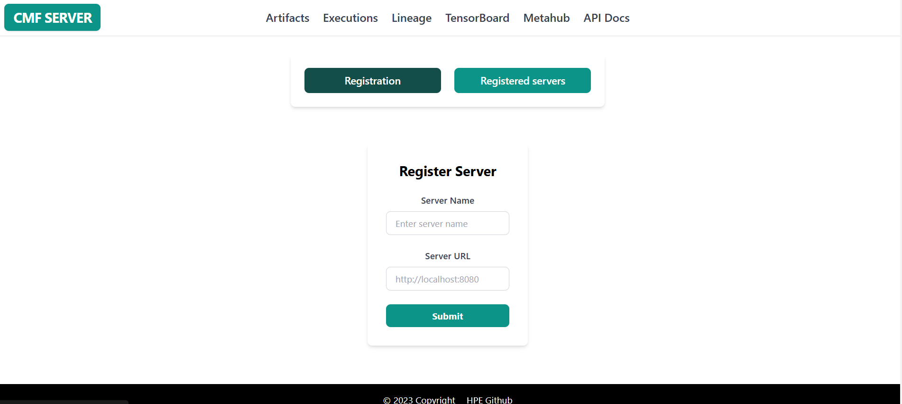
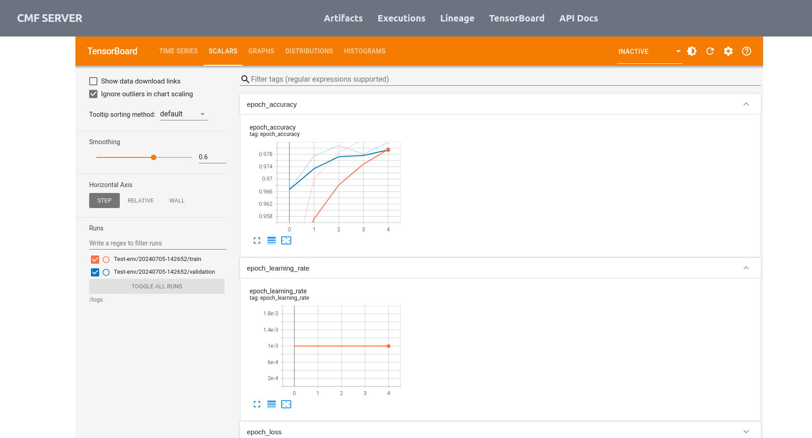

# Getting Started with CMF GUI

The CMF GUI provides an intuitive, browser-based interface for exploring ML pipeline metadata, visualizing lineage relationships, and synchronizing metadata between multiple CMF servers. Built with React and D3.js, it offers interactive dashboards for artifacts, executions, and pipeline lineage.

## Overview

The CMF GUI consists of several main sections:

- **[Artifacts](artifacts.md)**: Browse, search, filter, compare, and inspect datasets, models, metrics, labels, and other tracked artifacts.
- **[Executions](executions.md)**: View pipeline runs, execution history, parameters, and associated artifacts.
- **[Lineage](lineage.md)**: Visualize data flow, dependencies, and relationships between artifacts and executions.
- **[Metahub](../cmf_server/metahub-tab-usage.md)**: Synchronize metadata between multiple CMF servers.
- **[TensorBoard](../cmf_client/tensorflow_guide.md)**: View ML training metrics and visualizations.

The GUI organizes metadata by pipelines and stages, enabling users to easily navigate and understand the lifecycle of machine learning assets.

---

## Quick Start

### Accessing the CMF GUI

1. Ensure the [CMF Server is running](../setup/index.md#install-cmf-server-with-gui)
2. Open your browser and navigate to the server URL (default: `http://your-server-ip:80`)
3. The GUI will display the available pipelines on the home page.

---

## Artifacts View

The Artifacts page displays all datasets, models, metrics, labels, and other tracked artifacts managed by CMF. Artifacts are organized by pipeline and stage, allowing users to quickly locate inputs used and outputs generated during different phases of the machine learning workflow.

### Key Features

- **Pipeline Navigation**: Select a pipeline to view its associated stages.
- **Stage-Based Filtering**: Click on a stage (such as Prepare, Featurize, Train, or Evaluate) to display the artifacts generated or used within that stage.
- **Artifact Type Filtering**: Filter artifacts by type, including Dataset, Model, Metrics, Label, and Step Metrics.
- **Search & Filter**: Find artifacts using names, metadata, labels, or properties.
- **Artifact Comparison**: Compare multiple artifacts to identify metadata and version differences.
- **Artifact Details Panel**: View detailed metadata, provenance information, and custom properties.
- **Version Tracking**:  Explore artifact history and associated metadata.

---

## Executions View

The Executions page displays all pipeline runs and execution history. You can view execution details, parameters, and associated artifacts for each run to understand how outputs were generated throughout the ML lifecycle.

### Key Features

- **Pipeline Navigation**: Select a pipeline to view its associated stages.
- **Stage-Based Filtering**: Click on a stage (such as Prepare, Featurize, Train, or Evaluate) to display the executions generated or used within that stage.
- **Execution History**: View execution timelines and timestamps.
- **Execution Details**:Inspect execution parameters, metadata, and associated artifacts.
- **Filtering & Search**: Find specific executions using metadata, execution names, or properties.

---

## Lineage Visualization

The Lineage page offers interactive visualizations of data flow and dependencies in your ML pipelines. It provides following different visualization modes:

### Visualization Types

1. **Artifact Lineage**: Hierarchical view of artifact dependencies
2. **Execution Lineage**: Hierarchical view of execution flow
3. **Artifact-Execution Lineage**: Combined view showing both artifacts and executions

---

## Metahub

The [Metahub](../cmf_server/metahub-tab-usage.md) feature enables synchronization of metadata between two CMF servers, allowing distributed teams to collaborate and share ML pipeline metadata.

---

## TensorBoard Integration

CMF integrates with [TensorBoard](../cmf_client/tensorflow_guide.md) to visualize training metrics, model graphs, and other ML-specific visualizations alongside CMF metadata.

---

## Prerequisites

Before using the CMF GUI, ensure you have:

1. **CMF Server Running**: Follow the [installation guide](../setup/index.md#install-cmf-server-with-gui)
2. **Metadata Pushed**: Use `cmf metadata push` to send metadata to server
3. **Browser Compatibility**: Modern browser (Chrome, Firefox, Safari, Edge)

---

## Getting Help

- For API details, see [cmflib Documentation](../cmflib/index.md)
- For CLI commands, see [CMF Client Commands](../cmf_client/cmf_client_commands.md)
- For server setup, see [Installation & Setup](../setup/index.md)