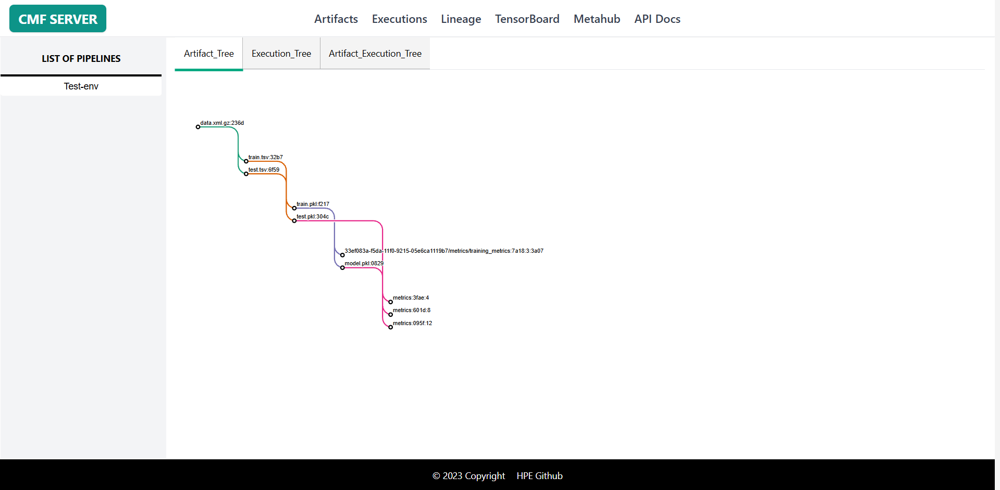
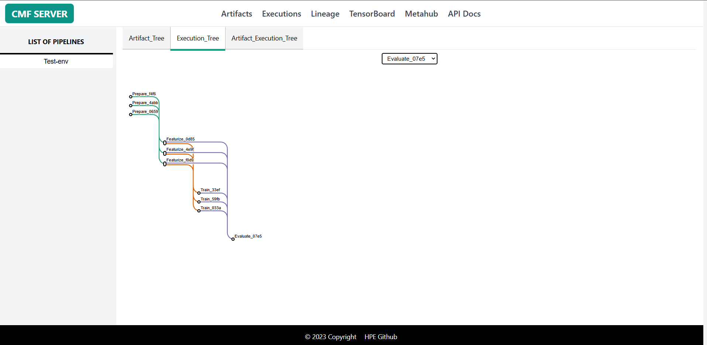
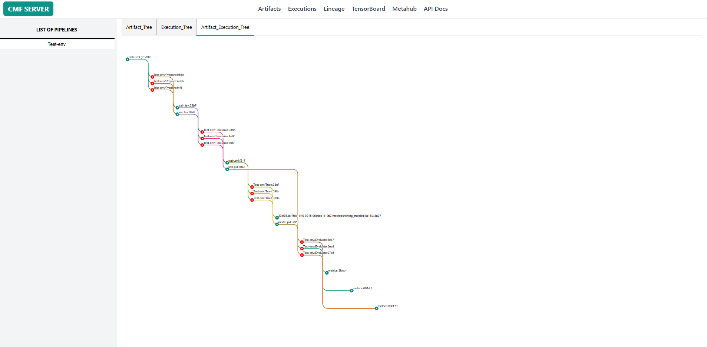

# Lineage Visualization Page

The Lineage page provides interactive visualizations of data flow and dependencies in your ML pipelines. It helps you understand how artifacts and executions are connected, trace data provenance, and analyze pipeline structure.

Lineage tracking captures the relationships between:

- **Artifacts**: Datasets, models, and metrics
- **Executions**: Pipeline stage runs
- **Data Flow**: How data moves through pipeline stages
- **Dependencies**: Which artifacts depend on which executions

---

## Visualization Types

The Lineage page offers four different visualization modes:

### 1. Artifact Tree

**Purpose**: Hierarchical view of artifact dependencies

**Use Cases**:
- Understand data transformation pipeline
- Trace dataset lineage from raw to final
- Identify reused artifacts across stages

**Features**:
- Tree layout showing parent-child relationships
- Color-coded by artifact type (Dataset/Model/Metrics)
- Expandable/collapsible nodes
- Hover for artifact details

### 2. Execution Tree

**Purpose**: Hierarchical view of execution dependencies

**Use Cases**:

- Understand pipeline execution flow
- Debug pipeline stage ordering
- Identify parallel vs sequential stages

**Features**:

- Select specific execution type from dropdown
- Shows execution order and dependencies

### 3. Artifact-Execution Tree

**Purpose**: Combined view showing both artifacts and executions

**Use Cases**:

- Complete end-to-end pipeline visualization
- Understand which execution created which artifact
- Trace full data lineage with transformations

**Features**:

- Alternating artifact and execution nodes
- Shows input/output relationships
- Complete provenance trail
- Filtered by pipeline

## Using the Lineage Page

### Example 1: Trace Data Provenance

**Goal**: Understand where a specific model's training data came from

1. Navigate to **Lineage** page
2. Select your pipeline from dropdown
3. Choose **Artifact Tree** tab
4. Find your trained model in the tree
5. Trace backwards to see:
   - Training dataset used
   - Preprocessing steps applied
   - Original raw data source

### Example 2: Debug Pipeline Execution Order

**Goal**: Verify stages executed in correct sequence

1. Select **Execution Tree** tab
2. Choose the execution type from dropdown
3. View the tree structure showing:
   - Which stages ran first
   - Which stages ran in parallel
   - Dependencies between stages
4. Identify any out-of-order executions

### Example 3: Analyze Full Pipeline Flow

**Goal**: Get complete picture of data flow through pipeline

1. Select **Artifact-Execution Tree** tab
2. View the alternating artifact → execution → artifact pattern
3. Trace a specific data path:
   - Start from input dataset
   - Follow through each transformation
   - End at final output (model/metrics)
4. Hover on nodes to see details
5. Click to navigate to artifact or execution page

### Example 4: Find Reused Artifacts

**Goal**: Identify which artifacts are used by multiple executions

1. Use **Artifact Tree** visualization
2. Look for artifacts with multiple outgoing edges
3. These artifacts are inputs to multiple stages
4. Useful for understanding data sharing patterns
5. Can help identify opportunities for caching

---

## Related Pages

- [Artifacts Page](artifacts.md) - Detailed artifact information
- [Executions Page](executions.md) - Execution details and logs
- [CMF Client Commands](../cmf_client/cmf_client_commands.md) - CLI for metadata management
- [Installation & Setup](../setup/index.md) - Set up CMF Server

---

## Additional Resources

### Understanding Lineage Concepts

- **Provenance**: History of an artifact's creation and transformations
- **Upstream**: Artifacts and executions that contributed to current node
- **Downstream**: Artifacts and executions that depend on current node
- **Lineage Graph**: Directed acyclic graph (DAG) of dependencies
