# Lineage Visualization Page

The Lineage page provides interactive visualizations of data flow and dependencies in your ML pipelines. It helps you understand how artifacts and executions are connected, trace data provenance, and analyze pipeline structure.

## Overview

Lineage tracking captures the relationships between:
- **Artifacts**: Datasets, models, and metrics
- **Executions**: Pipeline stage runs
- **Data Flow**: How data moves through pipeline stages
- **Dependencies**: Which artifacts depend on which executions


---

## Visualization Types

The Lineage page offers four different visualization modes:

### 1. Artifact Tree

**Purpose**: Hierarchical view of artifact dependencies

**Use Cases**:
- Understand data transformation pipeline
- Trace dataset lineage from raw to final
- Identify reused artifacts across stages

**Features**:
- Tree layout showing parent-child relationships
- Color-coded by artifact type (Dataset/Model/Metrics)
- Expandable/collapsible nodes
- Hover for artifact details


### 2. Execution Tree

**Purpose**: Hierarchical view of execution dependencies

**Use Cases**:
- Understand pipeline execution flow
- Debug pipeline stage ordering
- Identify parallel vs sequential stages

**Features**:
- Select specific execution type from dropdown
- Shows execution order and dependencies
- Git commit info on hover
- Execution status indicators

**Example View**:
```
pipeline_root
├── download_data
│   └── outputs: raw_data.csv
├── preprocess
│   ├── inputs: raw_data.csv
│   └── outputs: clean_data.csv
├── split_data
│   ├── inputs: clean_data.csv
│   └── outputs: train.csv, test.csv
├── train_model (parallel)
│   ├── inputs: train.csv
│   └── outputs: model.pkl
└── evaluate (parallel)
    ├── inputs: model.pkl, test.csv
    └── outputs: metrics.json
```

### 3. Artifact-Execution Tree

**Purpose**: Combined view showing both artifacts and executions

**Use Cases**:
- Complete end-to-end pipeline visualization
- Understand which execution created which artifact
- Trace full data lineage with transformations

**Features**:
- Alternating artifact and execution nodes
- Shows input/output relationships
- Complete provenance trail
- Filtered by pipeline

**Visualization**:

```mermaid
graph TB
    A1["📦 raw_data.csv"]
    E1["⚙️ preprocess"]
    A2["📦 cleaned_data.csv"]
    E2["⚙️ train"]
    A3["🤖 model.pkl"]
    E3["⚙️ evaluate"]
    A4["📊 metrics.json"]

    A1 -->|"INPUT"| E1
    E1 -->|"OUTPUT"| A2
    A2 -->|"INPUT"| E2
    E2 -->|"OUTPUT"| A3
    A3 -->|"INPUT"| E3
    E3 -->|"OUTPUT"| A4

    style A1 fill:#e3f2fd
    style A2 fill:#e3f2fd
    style A3 fill:#fff3e0
    style A4 fill:#f3e5f5
    style E1 fill:#c8e6c9
    style E2 fill:#c8e6c9
    style E3 fill:#c8e6c9
```


### 4. Force-Directed Graph (Legacy)

**Purpose**: Network graph showing all relationships

**Use Cases**:
- Explore complex pipeline relationships
- Identify data sharing between stages
- Find circular dependencies

**Features**:
- Interactive physics-based layout
- Zoom and pan controls
- Node dragging for custom layout
- Multiple artifacts and executions visible

---

## Page Interface

### Navigation Controls

1. **Pipeline Selector**: Dropdown to choose which pipeline to visualize
2. **Lineage Type Tabs**: Switch between visualization modes
   - Artifact Tree
   - Execution Tree
   - Artifact-Execution Tree
3. **Execution Dropdown**: (for Execution Tree) Select specific execution
4. **Zoom Controls**: Zoom in/out of visualization
5. **Reset View**: Reset zoom and pan to default
6. **Export**: Save visualization as PNG or SVG

### Visualization Controls

| Control | Function | Shortcut |
|---------|----------|----------|
| **Pan** | Click and drag background | Mouse drag |
| **Zoom** | Scroll to zoom in/out | Mouse wheel |
| **Node Click** | Show node details | Left click |
| **Node Hover** | Quick preview | Hover |
| **Reset View** | Reset to default view | Double click |
| **Select Node** | Highlight path | Click + Ctrl |

### Node Information

**Artifact Nodes** show:
- Artifact name
- Type icon (📦 Dataset, 🤖 Model, 📊 Metrics)
- Version/hash (shortened)
- Creation timestamp

**Execution Nodes** show:
- Execution name
- Status icon (✅ Completed, ❌ Failed, 🔄 Running)
- Duration
- Git commit (short hash)

---

## Using the Lineage Page

### Example 1: Trace Data Provenance

**Goal**: Understand where a specific model's training data came from

1. Navigate to **Lineage** page
2. Select your pipeline from dropdown
3. Choose **Artifact Tree** tab
4. Find your trained model in the tree
5. Trace backwards to see:
   - Training dataset used
   - Preprocessing steps applied
   - Original raw data source
6. Click on artifacts to see version details

### Example 2: Debug Pipeline Execution Order

**Goal**: Verify stages executed in correct sequence

1. Select **Execution Tree** tab
2. Choose the execution type from dropdown
3. View the tree structure showing:
   - Which stages ran first
   - Which stages ran in parallel
   - Dependencies between stages
4. Check timestamps to verify timing
5. Identify any out-of-order executions

### Example 3: Analyze Full Pipeline Flow

**Goal**: Get complete picture of data flow through pipeline

1. Select **Artifact-Execution Tree** tab
2. View the alternating artifact → execution → artifact pattern
3. Trace a specific data path:
   - Start from input dataset
   - Follow through each transformation
   - End at final output (model/metrics)
4. Hover on nodes to see details
5. Click to navigate to artifact or execution page

### Example 4: Find Reused Artifacts

**Goal**: Identify which artifacts are used by multiple executions

1. Use **Artifact Tree** visualization
2. Look for artifacts with multiple outgoing edges
3. These artifacts are inputs to multiple stages
4. Useful for understanding data sharing patterns
5. Can help identify opportunities for caching

---

## Advanced Features

### Path Highlighting

Click on a node to highlight the full path:
- **Upstream**: Shows all ancestors (sources)
- **Downstream**: Shows all descendants (consumers)
- **Complete Path**: Full lineage from source to current node

### Filtering Options

Filter the lineage graph:
- **By Artifact Type**: Show only Datasets, Models, or Metrics
- **By Time Range**: Show only recent executions
- **By Status**: Show only completed/failed executions
- **By Branch**: Filter by Git branch

### Search in Graph

Search for specific nodes:
```
Search by name: "train_data"
Search by type: type:model
Search by property: property:accuracy>0.9
Search by date: created:2026-01-21
```

### Graph Layouts

Choose different layout algorithms:
- **Tree (Hierarchical)**: Top-down or left-right tree
- **Force-Directed**: Physics-based natural layout
- **Radial**: Circular layout with center node
- **Layered**: Organized by pipeline stage layers

---

## API Endpoints

The Lineage page uses these CMF Server endpoints:

```python
# Artifact lineage (force-directed graph)
GET /artifact-lineage/force-directed-graph/{pipeline}

# Artifact tree (hierarchical)
GET /artifact-lineage/tangled-tree/{pipeline}

# Execution types list
GET /list-of-executions/{pipeline}

# Execution lineage
GET /execution-lineage/force-directed-graph/{pipeline}/{uuid}

# Execution tree
GET /execution-lineage/tangled-tree/{uuid}/{pipeline}

# Combined artifact-execution tree
GET /artifact-execution-lineage/tangled-tree/{pipeline}
```

### Programmatic Lineage Queries

Query lineage using CmfQuery:

```python
from cmflib.cmfquery import CmfQuery

# Initialize query
query = CmfQuery(mlmd_path="/path/to/mlmd")

# Get all artifacts in a lineage
artifact = query.get_artifact("trained_model.pkl")
lineage = query.get_artifact_lineage(artifact['id'])

# Get upstream artifacts (inputs)
upstream = lineage['upstream_artifacts']
for art in upstream:
    print(f"Input: {art['name']} (Type: {art['type']})")

# Get downstream artifacts (outputs)
downstream = lineage['downstream_artifacts']
for art in downstream:
    print(f"Output: {art['name']} (Type: {art['type']})")

# Get execution lineage
execution_id = 42
exec_lineage = query.get_execution_lineage(execution_id)
print(f"Input artifacts: {exec_lineage['inputs']}")
print(f"Output artifacts: {exec_lineage['outputs']}")
```

---

## Lineage Data Structure

The lineage visualizations use this data structure:

```json
{
  "nodes": [
    {
      "id": "a_123",
      "name": "artifact_name_train_data.csv",
      "type": "artifact",
      "artifact_type": "Dataset",
      "uri": "s3://bucket/data/train.csv",
      "created_at": "2026-01-21T10:30:00Z"
    },
    {
      "id": "e_456",
      "name": "execution_name_train_model",
      "type": "execution",
      "status": "completed",
      "git_commit": "a3f9e2b7",
      "duration": 328
    }
  ],
  "links": [
    {
      "source": "a_123",
      "target": "e_456",
      "type": "INPUT"
    },
    {
      "source": "e_456",
      "target": "a_789",
      "type": "OUTPUT"
    }
  ]
}
```

---

## Tips and Best Practices

1. **Start with Artifact Tree**: Easiest to understand data flow
2. **Use Execution Tree for Debugging**: Shows actual execution order
3. **Full Tree for Documentation**: Artifact-Execution tree shows complete story
4. **Export Visualizations**: Save lineage graphs for documentation
5. **Regular Review**: Check lineage after pipeline changes
6. **Identify Bottlenecks**: Long execution times visible in lineage
7. **Reusability Analysis**: Find commonly reused artifacts
8. **Version Tracking**: Use lineage to track artifact versions

---

## Troubleshooting

### Empty Lineage Graph

**Issue**: No nodes appear in visualization

**Solutions**:
1. Verify pipeline has executions
2. Check if metadata was pushed to server
3. Ensure artifacts were logged during execution
4. Refresh the page
5. Try different lineage type

### Incomplete Lineage

**Issue**: Some connections are missing

**Solutions**:
1. Ensure all artifacts are logged:
   ```python
   cmf.log_dataset("data.csv", "input")
   cmf.log_dataset("output.csv", "output")
   ```
2. Verify execution completion
3. Check for errors in metadata push
4. Ensure proper input/output event logging

### Performance Issues

**Issue**: Large graphs are slow to render

**Solutions**:
1. Use filters to reduce complexity
2. Focus on specific pipeline stages
3. Use Tree view instead of Force-Directed
4. Consider breaking large pipelines into sub-pipelines
5. Increase browser memory allocation

### Overlapping Nodes

**Issue**: Nodes overlap and are hard to read

**Solutions**:
1. Use zoom controls to spread out graph
2. Manually drag nodes to reposition
3. Try different layout algorithm
4. Export as SVG and edit externally
5. Increase visualization area size

---

## Related Pages

- [Artifacts Page](artifacts.md) - Detailed artifact information
- [Executions Page](executions.md) - Execution details and logs
- [CMF Client Commands](../cmf_client/cmf_client_commands.md) - CLI for metadata management
- [Installation & Setup](../setup/index.md) - Set up CMF Server

---

## Additional Resources

### Understanding Lineage Concepts

- **Provenance**: History of an artifact's creation and transformations
- **Upstream**: Artifacts and executions that contributed to current node
- **Downstream**: Artifacts and executions that depend on current node
- **Lineage Graph**: Directed acyclic graph (DAG) of dependencies

### Best Practices for Lineage Tracking

1. **Always log inputs and outputs**:
   ```python
   # Log input
   cmf.log_dataset("input.csv", "input")
   
   # Your processing logic
   
   # Log output
   cmf.log_dataset("output.csv", "output")
   ```

2. **Use descriptive names**: Makes lineage graphs easier to understand

3. **Track all transformations**: Don't skip intermediate artifacts

4. **Version consistently**: Use semantic versioning for clarity

5. **Document pipelines**: Add descriptions to help interpret lineage